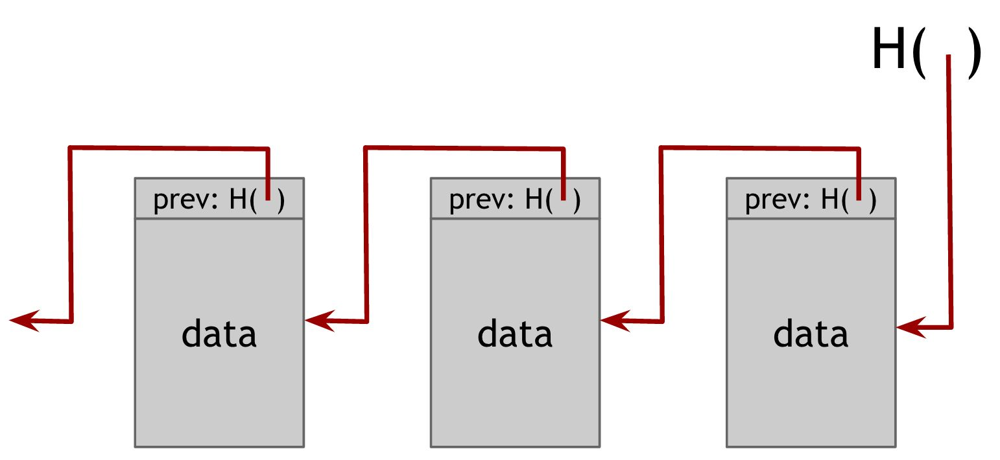
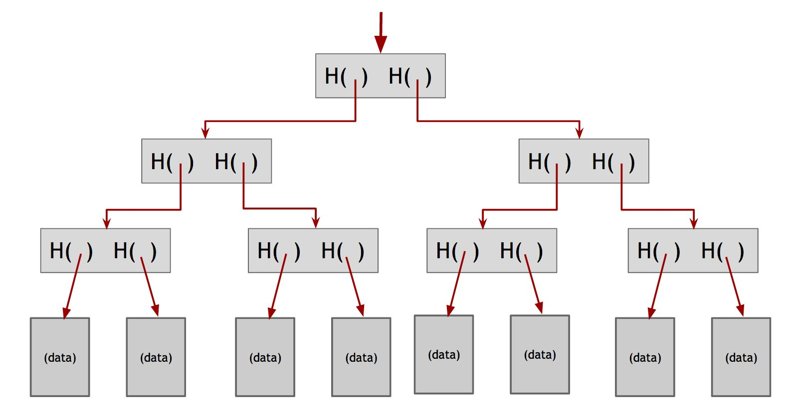
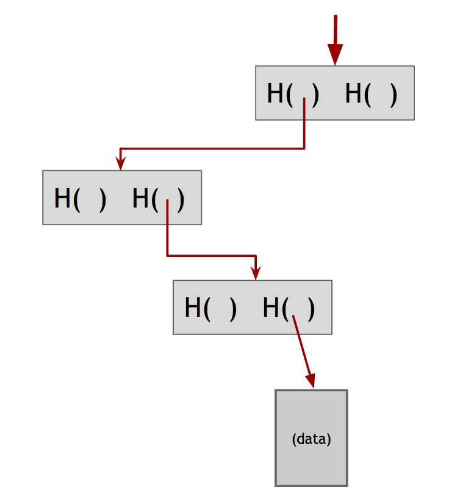

# 1 Introduction to cryptography cryptocurrencies
- Use cryptography to prevent tampering and equivocation, as well as to encode the rules for creating new units of the currency into a mathematical protocol
## 1.1 Cryptographic hash function
- 通用哈希函数
    1. 任何尺寸的字符串作为输入
    2. 输出固定长度的字符串（如 256-bit）
    3. Efficiently computable
        - 计算 n 位（n-bit）字符串的 hash 的时间复杂度应是 `O(n)`
        <!-- - Computing the hash of an n‐bit string should have a running time that is `O(n)` -->
 - Cryptographic hash functions 额外的特性要求
    1. Collision-resistance
    2. Hiding
    3. Puzzle-friendliness
### Collision-resistance
- 碰撞指不同的输入产生相同的输出
<!-- - A collision occurs when two distinct inputs produce the same output -->
- A hash function `H` is said to be collision resistant if it is infeasible to find two values, `x` and `y` , such that `x ≠ y` , yet `H(x) = H(y)`
- 碰撞必定存在
- 哈希函数的输入包括任意长度的所有字符串，输出只包含固定长度的字符串，必定存在大量的多对一
    - 挑 2^256+1 个输入计算输出（共 x^256 个结果），就必定存在碰撞
    - 随机挑 2^130+1 个输入就有 99.8% 的可能性至少有 2 个会冲突
        - > The fact that we can find a collision by only examining roughly the square root of the number of possible outputs results from a phenomenon in probability known as the *birthday paradox*
- 暴力破解不可行
    - 256 位的输出，最坏情况要算 2^256+1 次，平均要算约 2^128 次
        - > If a computer calculates 10,000 hashes per second, it would take more than one octillion (10^27) years to calculate 2^128 hashes
        - > If every computer ever made by humanity was computing since the beginning of the entire universe, up to now, the odds that they would have found a collision is still infinitesimally small. So small that it’s way less than the odds that the Earth will be destroyed by a giant meteor in the next two seconds
    - 因此没有通用的具有可行性的寻找碰撞的算法
- 对于特定的哈希函数，则存在计算碰撞的算法

    ```
    H(x) = x mod x^256
    ```

    - This function meets our requirements of a hash function as it accepts inputs of any length, returns a fixed sized output (256 bits), and is efficiently computable
    - One collision then would be the values 3 and 3 + 2^256
- 没有 hash 函数被证明是抵御碰撞的
<!-- - There are no hash functions proven to be collision‐resistant -->
- 实际使用的密码学 hash 函数是人们几经尝试尚未找到碰撞的函数，我们就认为这样的密码学 hash 函数是抵御碰撞的
    - MD5 hash 函数在找到碰撞后即被弃用
<!-- - The cryptographic hash functions that we rely on in practice are just functions for which people have tried really, really hard to find collisions and haven’t yet succeeded
    - In some cases, such as the old MD5 hash function, collisions were eventually found after years of work, leading the function to be deprecated and phased out of practical use -->
<!-- - And so we choose to believe that those are collision resistant -->
#### Application: Message digests
- 将密码学 hash 函数的输出用作信息摘要
    - 若 `x` 和 `y` 不相同，`H` 是抵御碰撞的密码学 hash 函数，则可以认为 `H(x)` 和 `H(y)` 不相同
    - 若 `H(x)` 和 `H(y)` 相同，由于 `x` 和 `y` 不相同，这样就违背了 `H` 是抵御碰撞的假设
<!-- - Use hash outputs as a **message digest**
    - If we know that two inputs `x` and `y` to a collision‐resistant hash function `H` are different, then it’s safe to assume that their hashes `H(x) and `H(y)` are different
        - If someone knew an `x` and `y` that were different but had the same hash, that would violate our assumption that `H` is collision resistant -->
- [ ] 对文件的哈希，哈希的是哪些部分？
### Hiding
- 隐匿：给定一个 hash 函数（`y=H(x)`）的输出 `y`，不存在具有可行性的方法可以用于找出 `x`
- 若 `x` 的可选集很小，则可轻易穷举得到 `x`
- 所以要满足隐匿的要求，`x` 的可选集必须很离散
- 若 `x` 的可选集本身不满足离散的要求，可以通过将 `x` 与另一个离散的值串联的方法实现隐匿
- A hash function `H` is hiding if: when a **secret value** `r` is chosen from a probability distribution that has high min‐entropy, then given `H(r || x)` it is infeasible to find `x`
    - In information‐theory, min‐entropy is a measure of how predictable an outcome is, and high min‐entropy captures the intuitive idea that the distribution (i.e., random variable) is very spread out
    - What that means specifically is that when we sample from the distribution, there’s no particular value that’s likely to occur
    - So, for a concrete example, if `r` is chosen uniformly from among all of the strings that are 256 bits long, then any particular string was chosen with probability (1/2)^256 , which is an infinitesimally small value
#### Application: Commitments
- 承诺的类比
    - S 将一个值放入信封，密封信封后，摆上台面，每个人都可以看见信封
    - S 之后告诉他人自己放入的值是 msg，他人可以拆开信封验证，S 无法说谎
- 一个 commit scheme 包含 2 个算法
    1. `com := commit(msg, nonce)`
    2. `verify(com, msg, nonce)`
        - Returns true if `com == commit(msg, nonce)` and false otherwise
    - 要求 `commit` 方法两个特性
        1. 隐匿：给出 `com` 试图找到对应的 `msg` 不可行
        2. Binding: 找不到这样的两对 `(msg, nonce)` 和 `(msg', nonce')`，满足 `msg != msg'` 且 `nonce != nonce'`，但是 `commit(msg, nonce) == `commit(msg', nonce')` 的条件
            - S 无法提交 `msg` 却事后声称提交的是 `msg'`
- 密码学中的 nonce 指只能用一次的值
- 公布出一个 `com` 值；之后虽然再公布生成该 `com` 的 `msg` 和 `nonce`，供他人验证之前提交的值确实提交的是 `msg`
- 密码学 hash 函数满足 commit scheme 的要求
### Puzzle friendliness
- A hash function `H` is said to be puzzle‐friendly if for every possible `n`‐bit output value `y` , if `k` is chosen from a distribution with high min‐entropy, then it is infeasible to find `x` such that `H(k || x) = y` in time significantly less than `2^n` 
    - Intuitively, what this means is that if someone wants to target the hash function to come out to some particular output value `y` , that if there’s part of the input that is chosen in a suitably randomized way, it’s very difficult to find another value that hits exactly that target
#### Application: search puzzle
- Search puzzle is a mathematical problem which requires searching a very large space in order to find the solution
    - In particular, a search puzzle has no shortcuts. That is, there’s no way to find a valid solution other than searching that large space
- A search puzzle consists of
    1. a hash function, `H`
    2. a value, id (which we call the `puzzle‐ID` ), chosen from a high min‐entropy distribution
    3. and a target set `Y`
    - A solution to this puzzle is a value, `x` , such that `H( id ‖ x ) ∈ Y`
- 若 `H` 的输出是 `n` 位，则有 `2^n` 种取值；`Y` 集合的大小决定 puzzle 的难易；`puzzle-ID` 高度离散保证了没有捷径
- If a search puzzle is puzzle‐friendly, this implies that there’s no solving strategy for this puzzle which is much better than just trying random values of `x`. And so, if we want to pose a puzzle that’s difficult to solve, we can do it this way as long as we can generate `puzzle‐ID`s in a suitably random way
#### SHA-256
- Hash 函数要能接受任意长度的输入
- 若能构造出接受定长输入的有效 hash 函数，就可以通过 Merkle‐Damgard transform 将其转换为可以接受任意长度输入的有效 hash 函数
- SHA-256 利用了 Merkle‐Damgard transform
- 接受定长输入的抵御碰撞 hash 函数称作压缩函数
    - It has been proven that if the underlying compression function is collision resistant, then the overall hash function is collision resistant as well
- Merkle‐Damgard transform
    - 压缩函数接受长度为 `m` 的输入，输出的长度为 `n` （`n<m`）
    - 将 hash 函数的输入分成长度 `m-n` 的块
    - 将每个块和前一个块的输出一起传入压缩函数，此时的输入长度为 `(m-n)+n`，就是压缩函数所要求的输入长度
    - 由于第一个块没有前一个快的输出，就用 Initialization Vector (IV，可从标准文档查询)，每次调用某个 hash 函数都复用同一个 IV
    - 最后一个块的输出就是结果
- SHA-256 的压缩函数接受 768 位的输出，生成 256 位的输出，每个区块的大小为 512，IV 大小为 256
    - The input is “padded” so that its length is a multiple of 512 bits
.jpg)
## 1.2 Hash pointers and data structures
- hash 指针是指向一个存放了数据和该数据的密码学 hash 的地址的指针
### Block chain
- 区块链是用 hash 指针构造的链表
- 链表头（head of the list）被存储起来
    - 链表头是指向最新区块的 hash 指针
    <!-- - We store the head of the list, which is just a regular hash‐pointer that points to the most recent data block -->  


- 区块 k+1 的 hash `prev` 是对整个区块 k（数据加 `k` 的 `prev`）进行 hash 的结果
- 篡改者的目标是只记住区块链表头（最新一个区块）的 hash 指针的人不会察觉到链上的数据已被篡改
    - 改动区块 k 的数据，区块 k+1 的旧 hash 不再能正确匹配（hash 函数的抵御碰撞性保证了这一点），因此光改区块 k 的数据，区块 k 的数据和区块 k+1 的 hash 的不一致性就会被检测到
- If we **store** the head of the list, then even if the adversary modifies all of the pointers to be consistent with the modified data, the head pointer will be incorrect, and we will detect the tampering
### Merkle trees
- 用 hash 指针构造的二叉树

- 数据区块两两一组，两个数据区块的 hash 存在同一个父节点；父节点同样两两一组，两个父节点的 hash 存在同一个父节点；反复递归，直至根节点
- 记住根节点的 hash 就能检测出篡改
#### Proof of membership
- 只需要提供数据区块到根节点的路径即可验证数据区块是在 Merkle tree 里的

#### 有序的 Merkle tree
- 位于底部的数据区块是排好序的
#### Proof of non-membership
- 对于一个数据区块，可以算出它在有序的 Merkle tree 中的位置 `p`，算出 `p-1` 和 `p+1` 这两个位置的数据区块的路径，若这两个数据区块是连续的（通过和排好序的数据区块对比来判断），则目标区块不在 Merkle tree 里
- 基于指针的非成环的数据结构都可以用 hash 指针
## 1.3 Digital signatures
- 数字签名需要具备的特性
    1. 任何人可校验签名是否邮箱
    2. 数字签名要和具体文档绑定，不能为其它文档使用
- Digital signature scheme
    1. `(sk, pk) := generateKeys(keysize)`
        - `sk` 私钥，私密保存；`pk` 公钥，可分发给任何人
        - 通过公钥可校验数字签名（“字迹”鉴别器）
    2. `sig := sign(sk , message )`
    3. `isValid := verify(pk, message , sig)`
    - 要求有效的签名的校验结果必须通过（`verify(pk, message, sign(sk, message)) == true`）
    - 要求签名不可伪造
- `generateKeys` 和 `sign` 可以是随机算法；`generateKeys` 最好是随机算法，要为不同用户生成不同的 keys；`verify` 必须是确定性的
### 不可伪造
- Computationally infeasible to forge signatures
- 要求：攻击者知道公钥和一部分经过同一个私钥签名的信息，无法伪造其它信息的签名
- 允许攻击者得到他指定的一些信息的签名，允许其猜一定的次数
    - Allow the attacker to get signatures on some documents of his choice, for as long as he wants, as long as the number of guesses is plausible
        - To give an intuitive idea of what we mean by a plausible number of guesses, we would allow the attacker to try 1 million guesses, but not 2^80 guesses
        - In asymptotic terms, we allow the attacker to try a number of guesses that is a polynomial function of the key size, but no more (e.g. the attacker cannot try exponentially many guesses)
- 攻击者认为他见过足够多的签名后，选择一些信息 M（M 必须是攻击者未见过其私钥的信息），对其伪造签名；通过 `verify` 交易伪造是否成功
- 只有攻击者无论用何种算法，他伪造成功的几率都极低以至于可以认为事实上不可能发生，才能认为 signature scheme 是不可伪造的
- 数字签名实际实践的考量
    - 许多数字在签名算法是随机化的，因此需要好的随机源
    - 数字签名算法对其进行签名的信息的大小会有限制
        - 可以对信息的密码学 hash 进行签名
        - 也可以对 hash 指针签名，签名会保护整个结构，包括 hash 指针和 hash 指针的形成的链指向的一切
            - Everything the chain of hash pointers points to. For example, if you were to sign the hash pointer that was at the end of a block chain, the result is that you would effectively be digitally signing the that entire block chain
### ECDSA (Elliptic Curve Digital Signature Algorithm)
- 比特币采用 ECDSA，选取标准椭圆曲线 `secp256k1`，安全级别是 128 位
    - It is as difficult to break this algorithm as performing 2^128 symmetric‐key cryptographic operations such as invoking a hash function
    - > TLS 选取的是 `secp256r1`
- 参数
    - 私钥：256 位
    - 公钥（未压缩）：512 位
    - 公钥（压缩）：257 位
    - 待签名信息：256 位
    - 签名：512 位
- 随机源很关键
    - [ ] 是这个 `secp256k1`?
## 1.4 Public keys as identities
- 公钥可以理解为身份
    - 一个 pk `verify` 通过，表示 pk 和用于该信息签名的 sk 是一对，指向一个身份
- 实践中，由于 pk 较大，可以用 pk 的 hash 当作身份
### 去中心化身份管理
- 比特币中身份也称作地址，即公钥的 hash
- 若 2 个用户用一个随机源或用了可预测的随机源，则理论上的保证失效
## 1.5 A simple cryptocurrency