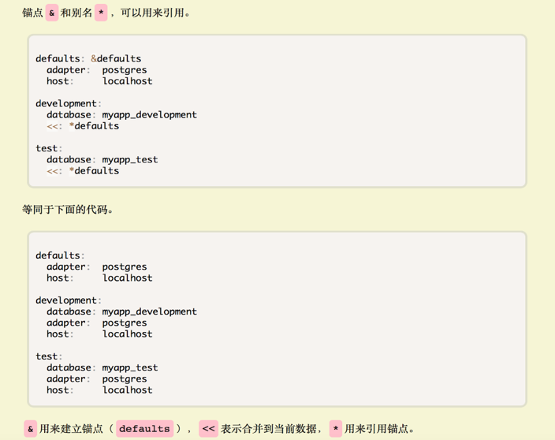

- 一个 Fabric Kafka 网络由一个 Zookeeper 集群，一个 Kafka 集群，N 个 Orderer 节点，M 个 Peer 节点组成。Zookeeper 用来管理 Kafka 集群，Kafka 用来对交易进行排序，Orderer 节点负责分发交易和生成区块，Peer 节点用来执行 chaincode 和记账。
- A 机器
    - 192.168.9.55
    - zookeeper0, kafka0, kafka1, orderer0.example.com, peer0.org1.example.com
- B 机器
    - 192.168.9.63
    - zookeeper1, zookeeper2, kafka2, kafka3, orderer1.example.com, peer0.org2.example.com
# Makefile
- `fabirc/gotools/Makefile`
	
    ```makefile
    # GOTOOLS = golint govendor goimports protoc-gen-go ginkgo gocov gocov-xml misspell
    GOTOOLS = protoc-gen-go
    ```

- `fabric/Makefile`
	
    ```makefile
    # IMAGES = peer orderer ccenv javaenv buildenv testenv zookeeper kafka couchdb tools
    IMAGES = peer orderer ccenv tools

    all: native docker checks
    all: native docker

    # build/bin/peer: build/image/ccenv/$(DUMMY) build/image/javaenv/$(DUMMY)
    # build/image/peer/$(DUMMY): build/image/ccenv/$(DUMMY) build/image/javaenv/$(DUMMY)
    build/bin/peer: build/image/ccenv/$(DUMMY)
    build/image/peer/$(DUMMY): build/image/ccenv/$(DUMMY)
    ```

# `crypto-config.yaml`
- `OrdererOrgs`：包含所有 Orderer 节点相关的组织。
- `PeerOrgs`：包含所有 Peer 节点相关的组织。
- `Domain` 作用如下：
    - 用以生成节点证书里的字段，在证书检查时使用
    - 工具在生成组织证书时，按照 `Domain` 内容进行目录区分
    - 组织间的 `Domain` 没有关联，Orderer 组织与 Peer 组织的域名可以不一致
- `Template.Count`：为组织生成 N 个 Peer 节点的证书。
- `Users.Count`：为组织生成 N 个 User 证书，用来配置 SDK 与 Orderer 节点或 Peer 节点连接。
- `crypto-config` 目录包含 `ordererOrganizations` 和 `peerOrganizations` 两个子目录。`ordererOrganizations` 目录包含所有 Orderer 节点的证书。每个 Orderer 节点的证书存放于由其域名命名的子目录下；`peerOrganizations` 目录包含了所有 Peer 组织的证书。
    - > 本例包含了两个组织，分别是 Org1 和 Org2，并在 Org1 组织下指定生成两个 Peer 节点的证书和一个 User 证书，所以最终 Peers 目录下有两个 Peer 节点的证书，users 里只有一个 User1 的证书。所有的 users 都必须包含一个 Admin 证书，用来进行权限控制。
- Peer, Orderer 等不同角色的身份以及签名通过 MSP 来实现。MSP 运行时会从配置文件([ ] `core.yaml` 与 `orderer.yaml` 详见 7)指定的目录中去获取证书。
## 证书目录
- `admincerts`：Fabric 1.0 下不同的角色有不同的权限控制，`admincerts` 可以指定 `admin` 拥有哪些权限
- `cacerts`：`cacerts` 是指证书的签发机构的证书。节点间通信采用 `tls` 模式时，Fabric 会要求验证请求者（包括 sdk 或其他节点）的签发机构的证书是否在本节点要求的（在创建链时可以指定）签发机构内，如果不在，则不可与本节点通信。
- `keystore`：对应私钥的位置。
- `signcerts`：`signcert` 是颁发给节点或用户的证书，[ ] 用以验证节点或者用户的签名。当 Peer 节点或者 Orderer 节点对 transaction 或 block 签名后，其他的 Peer 节点或 Orderer 节点需要对签名进行验证，就需要利用 `signcert` 里的证书进行验证。
- `tlscacerts`：当节点之间用 `tls` 加密通信时放置 `tls` 的 ca cert。
# `configtx.yaml`
- `configtx.yaml` 配置文件里包含了 Orderer 节点的配置信息和组织（名字、ID、证书目录、AnchorPeers 跨组织节点）信息。`configtxgen` 工具会根据 `configtx.yaml` 生成 Orderer 节点创世区块，同时产生新链的配置信息。

- 根据 `TwoOrgsOrdererGenesis` 里的配置信息，生成 Orderer 节点的创世块（`orderer.block`）。所有 Orderer 节点都按照 `orderer.block` 文件来启动。
# Kafka
- Kafka 对 Orderer 节点发来的交易进行排序。
- `ZOO_MY_ID`：表示 Zookeeper 的 id 号
- `ZOO_SERVERS`：表示 Zookeeper 集群，`zookeeper0:2888:3888` 通过 2888 端口与 leader 通讯，若无 leader，则通过 3888 选举 leader。
    - [ ] 顺序？
- `docker-compose -f docker-compose-kafka.yaml up zookeeper0`
- [ ] docker-compose document（看单独起一个服务）
- [x] 映射端口哪个是主机哪个是 docker
    - `HOST:CONTAINER`
- `KAFKA_BROKER_ID`：本 Kafka 节点的 id 号，必须唯一
- `KAFKA_ZOOKEEPER_CONNECT`: `Kafka` 节点关联的 Zookeeper 节点（所有 Kafka 节点配置一样）
- `KAFKA_DEFAULT_REPLICATION_FACTOR`：默认分区的 replication 个数 ，不能大于集群中 broker 的个数。
- `KAFKA_MIN_INSYNC_REPLICAS`：指定 replicas 的最小数目（必须确认每一个 repica 的写数据都是成功的），如果这个数目没有达到，producer 会产生异常。
- 对于所有的 Kafka 节点需要配置 `KAFKA_ADVERTISED_HOST_NAME` 为本物理机 IP，`KAFKA_ZOOKEEPER_CONNECT` 需要配置为三个 Zookeeper 的 endpoint (ip:port)。
    - 在多台主机上需要设置 `advertised.host.name` 为本机 IP， 在不进行设置时，默认的设置因操作系统原因可能是本机 IP 也可能是 localhost，为防止出错，需进行设置。
- `ZOO_SERVERS`: 都是本机都用左边（host）；多机时，本机用右边（container），远程用左边（host）
- docker-compose-kafka.yaml, dc-kafka.yaml
    - ./bddtests/dc-orderer-base.yml
    - ./bddtests/dc-peer-couchdb.yml
    - ./bddtests/dc-orderer-kafka-base.yml
    - ./bddtests/dc-orderer-kafka.yml
    - ./bddtests/dc-base.yml
    - ./bddtests/dc-peer-base.yml
- Verify container status
	
    ```bash
    # verify zookeeper
    # inside zookeeper
    echo stat | nc localhost 2181
    # Zookeeper version: 3.4.9-1757313, built on 08/23/2016 06:50 GMT
    # Clients:
    # /127.0.0.1:33436[0](queued=0,recved=1,sent=0)
    # Latency min/avg/max: 0/0/0
    # Received: 1
    # Sent: 0
    # Connections: 1
    # Outstanding: 0
    # Zxid: 0x100000000
    # Mode: leader
    # Node count: 4

    # verify kafka
    # inside zookeeper
    echo dump | nc localhost 2181 | grep broker
    # /brokers/ids/0
	# /brokers/ids/1
	# /brokers/ids/3
	# /brokers/ids/2
    
    # verify orderer
    docker logs orderer0
    # [sarama] 2019/07/30 02:08:29.624975 consumer.go:648: consumer/broker/3 added subscription to testchainid/0
    # 2019-07-30 02:08:29.625 UTC [orderer/kafka] try -> DEBU 0e7 [channel: testchainid] Error is nil, breaking the retry loop
    # 2019-07-30 02:08:29.625 UTC [orderer/kafka] startThread -> INFO 0e8 [channel: testchainid] Channel consumer set up successfully
    # 2019-07-30 02:08:29.625 UTC [orderer/kafka] startThread -> INFO 0e9 [channel: testchainid] Start phase completed successfully
    # 2019-07-30 02:08:29.628 UTC [orderer/kafka] processMessagesToBlocks -> DEBU 0ea [channel: testchainid] Successfully unmarshalled consumed message, offset is 0. Inspecting type...
    # 2019-07-30 02:08:29.628 UTC [orderer/kafka] processConnect -> DEBU 0eb [channel: testchainid] It's a connect message - ignoring
    # 2019-07-30 02:08:29.628 UTC [orderer/kafka] processMessagesToBlocks -> DEBU 0ec [channel: testchainid] Successfully unmarshalled consumed message, offset is 1. Inspecting type...
    # 2019-07-30 02:08:29.628 UTC [orderer/kafka] processConnect -> DEBU 0ed [channel: testchainid] It's a connect message - ignoring
    ```

- peer channel create -o orderer.checkbill:57050 -c mychannel -f ./channel-artifacts/channel.tx --tls true --cafile /opt/gopath/src/github.com/hyperledger/fabric/peer/crypto/ordererOrganizations/checkbill/orderers/orderer0.checkbill/msp/tlscacerts/tlsca.checkbill-cert.pem

<!-- gettext is keg-only, which means it was not symlinked into /usr/local,
because macOS provides the BSD gettext library & some software gets confused if both are in the library path.

If you need to have gettext first in your PATH run:
  echo 'export PATH="/usr/local/opt/gettext/bin:$PATH"' >> ~/.zshrc

For compilers to find gettext you may need to set:
  export LDFLAGS="-L/usr/local/opt/gettext/lib"
  export CPPFLAGS="-I/usr/local/opt/gettext/include" -->