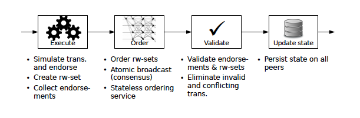
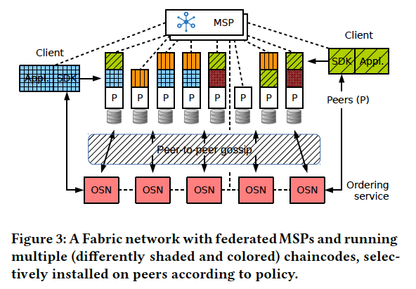
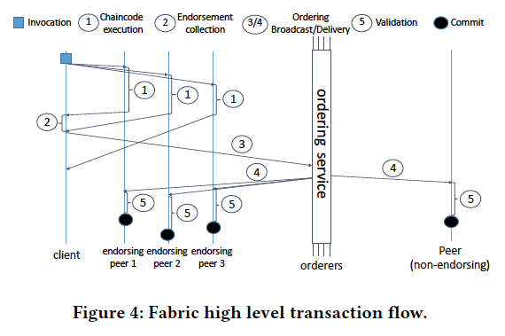
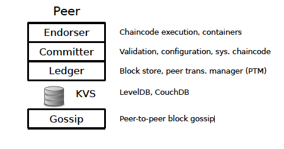

<!-- https://arxiv.org/abs/1801.10228v2 -->
- A permissioned blockchain provides a way to secure the interactions among a group of entities that have a common goal but which do **not fully trust each other**, such as businesses that exchange funds, goods, or information. 
- By relying on the identities of the peers, a permissioned blockchain can use traditional Byzantine-fault tolerant (BFT) consensus.
# *order-execute* architecture
- A PoW-based permissionless blockchain such as Ethereum combines consensus and execution of transactions as follows
    1. every peer (i.e., a node that participates in consensus) assembles a block containing valid transactions (to establish validity, this peer already pre-executes those transactions);
    2. the peer tries to solve a PoW puzzle;
    3. if the peer is lucky and solves the puzzle, it disseminates the block to the network via a gossip protocol;
    4. every peer receiving the block validates the solution to the puzzle and all transactions in the block.
    - Effectively, every peer thereby **repeats** the execution of the lucky peer from its first step. Moreover, all peers execute the transactions **sequentially** (within one block and across blocks).
    - Existing permissioned blockchains such as Tendermint, Chain, or Quorum typically use BFT consensus, provided by PBFT or other protocols for atomic broadcast. Nevertheless, they all follow the same order-execute approach and implement classical *active* SMR (*state-machine replication*).
- 3 most significant drawbacks
    1. *Sequential execution*
        - performance bottleneck
        - A denial-of-service (**DoS**) attack, which severely reduces the performance of such a blockchain, could simply introduce smart contracts that take a very long time to execute. For example, a smart contract that executes an infinite loop has a fatal effect, but cannot be detected automatically because the halting problem is unsolvable.
            - To cope with this issue, public programmable blockchains with a cryptocurrency **account for the execution cost**. Ethereum, for example, introduces the concept of *gas* consumed by a transaction execution, which is converted at a *gas price* to a cost in the cryptocurrency and billed to the submitter of the transaction.
            - It is not adequate in the permissioned model for a general-purpose system without a native cryptocurrency.
    2. *Non-deterministic code*
       - Operations executed after consensus in active SMR must be deterministic, or the distributed ledger “forks” and violates the basic premise of a blockchain, that **all peers hold the same state**.
       - Generic languages pose many problems for ensuring deterministic execution. Even if the application developer does not introduce obviously non-deterministic operations, hidden implementation details can have the same devastating effect (e.g., a map iterator is not deterministic in Go).
           - To make matters worse, on a blockchain the burden to create deterministic applications lies on the potentially untrusted programmer. Only one non-deterministic contract created with malicious intent is enough to bring the whole blockchain to a halt.
    3. *Confidentiality of execution*
        - According to the blueprint of public blockchains, many permissioned systems **run all smart contracts on all peers**. However, many intended use cases for permissioned blockchains require confidentiality, i.e., that access to smart-contract logic, transaction data, or ledger state can be restricted. 
            - Although cryptographic techniques, ranging from data encryption to advanced zero-knowledge proofs and verifiable computation, can help to achieve confidentiality, this often comes with a considerable overhead and is not viable in practice.
 - Fortunately, it suffices to propagate the same state to all peers instead of running the same code everywhere. Thus, the execution of a smart contract can be restricted to a subset of the peers trusted for this task, that vouch for the results of the execution. This design departs from active replication towards a variant of ***passive*** replication, adapted to the trust model of blockchain.
     - 主动复制：每个 peer 自己再次执行区块里的每个交易，通过后更新账本。
     - 被动复制：接收可信的结果，校验版本冲突和指定背书条件是否被满足；只有背书节点去预执行交易。
- The key properties of a blockchain system, namely **consistency**, **security**, and **performance**, must not depend on the knowledge and goodwill of its users, in particular since the blockchain should run in an untrusted environment.
# *execute-order-validate* architecture
- The architecture of Fabric follows a novel *execute-order-validate* paradigm for distributed execution of untrusted code in an untrusted environment. It separates the transaction flow into 3 steps, which may be run on different entities in the system: 
    1. executing a transaction and checking its correctness, thereby *endorsing* it (corresponding to “transaction validation” in other blockchains); 
    2. ordering through a consensus protocol, irrespective of transaction semantics; 
    3. and transaction validation per application-specific trust assumptions, which also prevents race conditions due to concurrency.
- Fabric typically executes transactions before reaching final agreement on their order.
    - In Fabric, every transaction is executed (*endorsed*) only by a subset of the peers, which **allows for parallel execution** and addresses potential non-determinism, drawing on “execute-verify” BFT replication. 
        - A flexible endorsement policy specifies which peers, or how many of them, need to vouch for the correct execution of a given smart contract.
        - Fabric uses *passive* or *primary-backup* replication as often found in distributed databases, but with middleware-based asymmetric update processing and ported to untrusted environments with Byzantine faults.
    - Fabric incorporates *active replication* in the sense that the transaction’s effects on the ledger state are only written after reaching **consensus on a total order** among them, in the deterministic validation step executed by each peer **individually**.
        - [x] This allows Fabric to respect application-specific trust assumptions according to the transaction endorsement.
        - Moreover, the ordering of state updates is delegated to a modular component for consensus (i.e., atomic broadcast), which is stateless and logically decoupled from the peers that execute transactions and maintain the ledger.
- To implement this architecture, Fabric contains modular building blocks for each of the following components:
    - An *ordering service* atomically broadcasts state updates to peers and establishes consensus on the order of transactions.
    - A *membership service provider* (MSP) is responsible for ***associating peers with cryptographic identities***. It maintains the permissioned nature of Fabric.
    - An optional *peer-to-peer gossip* service disseminates the blocks output by ordering service to all peers.
    - *Smart contracts* in Fabric run within a container environment for **isolation**. They can be written in standard programming languages but do not have direct access to the ledger state.
    - Each peer locally maintains the *ledger* in the form of the append-only blockchain and as a **snapshot** of the most recent state in a key-value store.  

- In a nutshell, a distributed application for Fabric consists of two parts:
    1. A smart contract, called *chaincode*, which is program code that implements the application logic and **runs during the *execution phase***. 
        - The chaincode is the central part of a distributed application in Fabric and may be written by an untrusted developer. Special chaincodes exist for **managing the blockchain system and maintaining parameters**, collectively called *system chaincodes*.
    2. An *endorsement* policy that is **evaluated in the *validation phase***. 
        - Endorsement policies cannot be chosen or modified by untrusted application developers. 
        - An endorsement policy acts as a **static library** for transaction validation in Fabric, which can merely be **parameterized by the chaincode**. 
        - Only designated administrators may have a permission to modify endorsement policies **through system management functions**. 
        - A typical endorsement policy lets the chaincode specify the endorsers for a transaction in the form of a set of peers that are necessary for endorsement; it uses a monotone logical expression on sets, such as “three out of five” or “(A ∧ B) ∨ C.” Custom endorsement policies may implement arbitrary logic.
- A client sends transactions to the peers specified by the endorsement policy. Each transaction is then **executed by specific peers** and its **output is recorded**; this step is also called *endorsement*.
- After execution, transactions enter the *ordering phase*, which uses a pluggable consensus protocol to **produce a totally ordered sequence of endorsed transactions grouped** in blocks. These are **broadcast to all peers**, with the (optional) help of *gossip*.
    - Unlike standard active replication, which totally orders transaction inputs, **Fabric orders transaction outputs combined with state dependencies**, as computed during the execution phase.
    - Each peer then validates the state changes from endorsed transactions with respect to the endorsement policy and the consistency of the execution in the *validation phase*.
    - All peers validate the transactions in the same order (以同样的顺序验证交易) and validation is deterministic. In this sense, Fabric introduces a novel *hybrid replication* paradigm in the Byzantine model, which combines passive replication (the pre-consensus computation of state updates) and active replication (the post-consensus validation of execution results and state changes).
- As Fabric is permissioned, all nodes that participate in the network have an identity, as provided by a modular membership service provider (MSP).

- Nodes in a Fabric network take up one of 3 roles:
    1. *Clients* **submit transaction proposals** for execution, help **orchestrate the execution phase**, and, finally, **broadcast transactions for ordering**.
    2. *Peers* execute transaction proposals and validate transactions.
        - All peers maintain the blockchain ledger, an append-only data structure **recording all transactions in the form of a hash chain**, as well as the state, a succinct representation of the **latest ledger state**.
        - Not all peers execute all transaction proposals, only a subset of them called *endorsing peers* (or, simply, *endorsers*) does, as **specified by the policy of the chaincode to which the transaction pertains**.
    3. *Ordering Service Nodes (OSN)* (or, simply, *orderers*) are the nodes that collectively form the ordering service. 
        - In short, the ordering service **establishes the total order of all transactions in Fabric**, where each transaction contains **state updates and dependencies** computed during the execution phase, along with **cryptographic signatures of the endorsing peers**. 
            - Orderers are entirely unaware of the application state, and do not participate in the execution nor in the validation of transactions. 
            - This design choice renders consensus in Fabric as modular as possible and simplifies replacement of consensus protocols in Fabric.
- A Fabric network actually supports multiple blockchains connected to the same ordering service. Each such blockchain is called a *channel* and may have different peers as its members.
    - Channels can be used to partition the state of the blockchain network, but consensus across channels is not coordinated and the total order of transactions in each channel is separate from the others.
    - Certain deployments that consider all orderers as trusted may also implement by-channel access control for peers.

## Execution Phase
- In the execution phase, clients sign and send the *transaction proposal* (or, simply, *proposal*) to one or more endorsers for execution.
    - Recall that every chaincode implicitly specifies a set of endorsers via the endorsement policy.
- A proposal contains:
    - the identity of the submitting client (according to the MSP)
    - the transaction payload in the form of an operation to execute
    - parameters
    - the identifier of the chaincode
    - a nonce to be used only once by each client (such as a counter or a random value)
    - a transaction identifier derived from the client identifier and the nonce
- The endorsers simulate the proposal, by executing the operation on the specified chaincode, which has been installed on the blockchain.
- A proposal is simulated against the endorser’s **local** blockchain state, without synchronization with other peers. Moreover, endorsers **do not persist** the results of the simulation to the ledger state.
    - The state of the blockchain is maintained by the *peer transaction manager (PTM)* in the form of a versioned key-value store, in which successive updates to a key have **monotonically increasing** version numbers.
- The chaincode runs in a Docker container, isolated from the main endorser process.
- The state created by a chaincode is **scoped exclusively to that chaincode** and cannot be accessed directly by another chaincode. 
    - Given the appropriate permission, a chaincode may invoke another chaincode to access its state **within the same channel**.
- The chaincode is not supposed to maintain the local state in the program code, only what it maintains in the blockchain state that is accessed with `GetState`, `PutState`, and `DelState` operations.
- As a result of the simulation, each endorser produces a value *writeset*, consisting of the state updates produced by simulation (i.e., the modified keys along with their new values), as well as a *readset*, representing the version dependencies of the proposal simulation (i.e., **all keys read during simulation along with their version numbers**). 
- After the simulation, the endorser cryptographically signs a message called *endorsement*, which contains readset and writeset (together with metadata such as transaction ID, endorser ID, and endorser signature) and sends it back to the client in a *proposal response*. 
- The client **collects endorsements** until they satisfy the endorsement policy of the chaincode, which the transaction invokes. In particular, this requires all endorsers as determined by the policy to produce the same execution result (i.e., **identical readset and writeset**). Then, the client proceeds to **create the transaction and passes (broadcasts) it to the ordering service**.
- As the endorsers simulate the proposal **without** synchronizing with other endorsers, two endorsers may execute it on different states of the ledger and produce different outputs. For the standard endorsement policy which requires multiple endorsers to produce the same result, this implies that under high contention of operations accessing the same keys, a client may not be able to satisfy the endorsement policy.
    - This is a new consideration compared to primary-backup replication in replicated databases with synchronization through middleware: a consequence of the assumption that no single peer is trusted for correct execution in a blockchain. (不信任单个 peer，信任背书策略要求的所有 peer 的一致结果)
    - > We consciously adopted this design, as it considerably simplifies the architecture and is adequate for typical blockchain applications. As demonstrated by the approach of Bitcoin, distributed applications can be formulated such that contention by operations accessing the same state can be reduced, or eliminated completely in the normal case (e.g., in Bitcoin, two operations that modify the same “object” are not allowed and represent a *double-spending attack*). 
    - > In the future, we plan to gradually enhance the liveness semantics of Fabric under contention, in particular to support [CRDTs](https://en.wikipedia.org/wiki/Conflict-free_replicated_data_type) for complementing the current version dependency checks, as well as a per-chaincode lead-endorser that would act as a transaction sequencer.
- Executing a transaction before the ordering phase is critical to tolerating non-deterministic chaincodes. A chaincode in Fabric with non-deterministic transactions can only endanger the liveness of its own operations, because a client might not gather a sufficient number of endorsements, for instance. 
    - This is a fundamental advantage over order-execute architecture, where non-deterministic operations lead to inconsistencies in the state of the peers.
- Tolerating non-deterministic execution also addresses DoS attacks from untrusted chaincode as an endorser can simply abort an execution according to a local policy if it suspects a DoS attack. This will not endanger the consistency of the system, and again, such unilateral abortion of execution is not possible in order-execute architectures.
    - [ ] Abort how?
## Ordering phase
- When a client has collected enough endorsements on a proposal, it assembles a transaction and submits this to the ordering service. 
- The transaction contains:
    - the transaction payload (i.e., the chaincode operation including parameters)
    - transaction metadata
    - a set of endorsements.
- The ordering phase establishes a total order on all submitted transactions **per channel**. In other words, ordering atomically broadcasts endorsements and thereby establishes consensus on transactions, [ ] despite faulty orderers. 
- Moreover, the ordering service batches multiple transactions into blocks and outputs a hash-chained sequence of blocks containing transactions. 
    - Grouping or batching transactions into blocks improves the throughput of the broadcast protocol, which is a well-known technique used in fault-tolerant broadcasts.
- At a high level, the interface of the ordering service only supports the following 2 operations invoked by a peer and implicitly parameterized by a channel identifier:
    1. `broadcast(tx)`
        - A client calls this operation to broadcast an arbitrary transaction `tx`, which usually contains the transaction payload and a signature of the client, for dissemination.
    2. B <- `deliver(s)`
        - A client calls this to retrieve block B with **non-negative** sequence number `s`.
            - The block contains a list of transactions `[tx1, . . . , txk]` and a hash-chain value `h` representing the block whose sequence number is `s − 1`, i.e., `B = ([tx1, . . . , txk],h)`.
 - The ordering service ensures that the delivered blocks on one channel are totally ordered. More specifically, ordering **ensures** the following safety properties for each channel:
    - Agreement
        - For any two blocks B delivered with sequence number `s` and B′ delivered with `s′` at correct peers such that `s` = `s′`, it holds B = B′.
    - Hash chain integrity
        - If some correct peer delivers a block B with number `s` and another correct peer delivers block `B′ = ([tx1, . . . , txk],h′)` with number `s+1`, then it holds `h′ = H(B)`, where `H(·)` denotes the cryptographic hash function.
    - No skipping
        - If a correct peer `p` delivers a block with number `s > 0` then for each `i = 0, . . . , s − 1`, peer `p` has already delivered a block with number `i`.
    - No creation
        - When a correct peer delivers block B with number `s`, then for every tx ∈ B some client has already broadcast `tx`.
- For liveness, the ordering service supports at least the following “eventual” property:
    - Validity: If a correct client invokes `broadcast(tx)`, then every correct peer eventually delivers a block B that includes `tx`, with some sequence number.
    - However, every individual ordering implementation is allowed to come with its own liveness and fairness guarantees with respect to client requests.
- Since there may be a large number of peers in the blockchain network, but only relatively few nodes are expected to implement the ordering service, Fabric can be configured to use a built-in *gossip service* for disseminating delivered blocks from the ordering service to all peers. 
    - The implementation of gossip is scalable and agnostic to the particular implementation of the ordering service, hence it works with both CFT and BFT ordering services, ensuring the modularity of Fabric.
- [ ] The ordering service may also perform access control checks to see if a client is allowed to broadcast messages or receive blocks on a given channel.
- It is very important that the ordering service does not maintain any state of the blockchain, and neither validates nor executes transactions. This architecture is a crucial, defining feature of Fabric, and makes Fabric the first blockchain system to totally separate consensus from execution and validation. 
    - This makes consensus as modular as possible, and enables an ecosystem of consensus protocols implementing the ordering service. 
- The hash chain integrity property and the chaining of blocks exist only to make the integrity verification of the block sequence by the peers more **efficient**. 
- Finally, note that we do not require the ordering service to prevent transaction duplication. This simplifies its implementation and is not a concern since **duplicated transactions are filtered in the read-write check by the peers during validation**.
    - [ ] 以交易为单位而不是以块为单位更新世界状态；double spend
## Validate Phase
- Blocks are delivered to peers either directly by the ordering service or through gossip. 
- A new block then enters the validation phase which consists of 3 **sequential** steps:
    1. The *endorsement policy evaluation* occurs in **parallel** for all transactions within the block. 
        - The evaluation is the task of the so-called *validation system chaincode (VSCC)*, a static library that is part of the blockchain’s configuration and is responsible for validating the endorsement with respect to the **endorsement policy configured for the chaincode**. 
        - If the endorsement is not satisfied, the transaction is marked as invalid and its effects are disregarded.
    2. A *read-write conflict check* is done for all transactions in the block **sequentially**. 
        - For each transaction it compares the versions of the keys in the readset field to those in the current state of the ledger, as stored locally by the peer, and ensures they are still the same. If the versions do not match, the transaction is marked as invalid and its effects are disregarded.
    3. The *ledger update* phase runs last, in which the block is appended to the locally stored ledger and the blockchain state is updated. 
        - In particular, when adding the block to the ledger, the results of the validity checks in the first two steps are persisted as well, in the form of a bit mask denoting the transactions that are valid **within the block**. This facilitates the reconstruction of the state at a later time. 
        - Furthermore, all state updates are applied by writing all key-value pairs in writeset to the local state. ([ ] version 在第二步已经更新掉了，只有值在第三步更新)
- The default VSCC in Fabric allows monotone logical expressions over the set of endorsers configured for a chaincode to be expressed. The VSCC evaluation verifies that the set of peers, as expressed through valid signatures on endorsements of the transaction, satisfy the expression. Different VSCC policies can be configured statically, however.
- The ledger of Fabric contains all transactions, including those that are deemed invalid. This follows from the overall design, because ordering service, which is agnostic to chaincode state, produces the chain of the blocks and because the validation is done by the peers post-consensus.
    - This feature is needed in certain use cases that require tracking of invalid transactions during subsequent audits, and stands in contrast to other blockchains (e.g., Bitcoin and Ethereum), where the ledger contains only valid transactions. 
    - In addition, due to the permissioned nature of Fabric, detecting clients that try to mount a DoS attack by flooding the network with invalid transactions is easy. One approach would be to black-list such clients according to a policy that could be put in place. 
    - Furthermore, a specific deployment could implement transaction fees to charge for transaction invocation, which would render a DoS attack prohibitively expensive.
## Trust and Fault Model
- Fabric can accommodate flexible trust and fault assumptions. 
- In general, any client is considered potentially malicious or Byzantine.
- Peers are grouped into organizations and every organization forms one trust domain, such that a peer trusts all peers within its organization but no peer of another organization. 
- The ordering service considers all peers (and clients) as potentially Byzantine.
- **The integrity of a Fabric network relies on the consistency of the ordering service**. 
- The trust model of the ordering service depends directly on its implementation. As of release v1.0.6, Fabric supports:
    -  a centralized, single-node implementation, used in development and testing
    -  a CFT ordering service running on a cluster
    -  a third implementation, a proof of concept based on BFT-SMaRt, tolerates up to one third of Byzantine OSNs
- Fabric **decouples** the trust model for applications from the trust model of consensus. Namely, a distributed application can define its own trust assumptions, which are conveyed through the **endorsement policy**, and are independent from those of consensus implemented by the **ordering service**.
# Fabric Components
- Fabric is written in Go and uses the gRPC framework for communication between clients, peers, and orderers.

## Membership Service
- The membership service provider (MSP) maintains the identities of all nodes in the system (clients, peers, and OSNs) and is responsible for **issuing node credentials** that are used for **authentication** and **authorization**.
- Since Fabric is permissioned, all interactions among nodes occur through messages that are authenticated, typically with **digital signatures**.
- The membership service comprises a component at **each node**, where it may authenticate transactions, verify the integrity of transactions, sign and validate endorsements, and authenticate other blockchain operations. 
    - Tools for key management and registration of nodes are also part of the MSP.
- Fabric allows 2 modes for setting up a blockchain network. 
    - In offline mode, credentials are generated by a CA and distributed out-of-band to all nodes. Peers and orderers can only be registered in offline mode. 
    - For enrolling clients, Fabric-CA provides an online mode that issues cryptographic credentials to them. The MSP configuration must ensure that all nodes, especially all peers, recognize the same identities and authentications as valid.
- The MSP permits identity federation, for example, when multiple organizations operate a blockchain network. Each organization issues identities to its own members and every peer recognizes members of all organizations. This can be achieved with multiple MSP instantiations, for example, by creating a mapping between each organization and an MSP.
## Ordering Service
- The ordering service **manages multiple channels**. 
- On every channel, it provides the following services:
    1. Atomic broadcast for establishing order on transactions, implementing the `broadcast` and `deliver` calls
    2. **Reconfiguration** of a channel, when its members modify the channel by broadcasting a configuration update transaction
    3. Optionally, access control, in those configurations where the ordering service acts as a trusted entity, restricting broadcasting of transactions and receiving of blocks to specified clients and peers.
- The ordering service is **bootstrapped** with a *genesis block* on the system channel. This block **carries a configuration transaction that defines the ordering service properties**.
- The current production implementation consists of ordering-service nodes (OSNs) that implement the operations described and **communicate through the system channel**. 
- The **actual atomic broadcast function** is provided by an instance of Apache Kafka which offers scalable publish-subscribe messaging and strong consistency despite node crashes, based on ZooKeeper. 
    - Kafka may run on physical nodes separate from the OSNs. 
    - The OSNs act as **proxies** between the peers and Kafka.
- An OSN directly injects a newly received transaction to the atomic broadcast (e.g., to the Kafka broker). OSNs batch transactions received from the atomic broadcast and form blocks. 
- A block is cut as soon as one of 3 conditions is met:
    1. the block contains the specified maximal number of transactions;
    2. the block has reached a maximal size (in bytes);
    3. an amount of time has elapsed since the first transaction of a new block was received.
    - This batching process is deterministic and therefore produces the same blocks at all nodes. It is easy to see that the first two conditions are trivially deterministic, given the stream of transactions received from the atomic broadcast.
    - To ensure deterministic block production in the third case, a node starts a timer when it reads the first transaction in a block from the atomic broadcast. If the block is not yet cut when the timer expires, the **OSN** broadcasts a special *time-to-cut* transaction on the channel, which indicates the sequence number of the block which it intends to cut. On the other hand, every OSN immediately cuts a new block upon receiving the first time-to-cut transaction for the given block number. Since this **transaction is atomically delivered to all connected OSNs**, they all include the same list of transactions in the block. 
        - 块由 OSN 切。
        - The OSNs **persist** a range of the most recently delivered blocks directly to their filesystem, so they can answer to peers retrieving blocks through `deliver`.
- The ordering service based on Kafka is one of 3 implementations currently available. A centralized orderer, called *Solo*, runs on one node and is used for development. A proof-of-concept ordering service based on BFT-SMaRt has also been made available; it ensures the atomic broadcast service, but not yet reconfiguration and access control.
## Peer Gossip
- One advantage of separating the execution, ordering, and validation phases is that they can be scaled independently. 
- However, since most consensus algorithms (in the CFT and BFT models) are **bandwidth-bound**, the throughput of the ordering service is capped by the network capacity of its nodes. 
    - Consensus cannot be scaled up by adding more nodes, rather, [ ] throughput will decrease. 
- However, since ordering and validation are decoupled, we are interested in efficiently broadcasting the execution results to all peers for validation, after the ordering phase. This, along with state transfer to newly joining peers and peers that were disconnected for a long time, is precisely the goal of the gossip component. 
- Fabric gossip utilizes epidemic multicast for this purpose. The blocks are signed by the ordering service. This means that a peer can, upon receiving all blocks, independently assemble the blockchain and verify its integrity.
- The communication layer for gossip is based on gRPC and utilizes TLS with mutual authentication, which enables each side to bind the TLS credentials to the identity of the remote peer. 
- The gossip component maintains an up-to-date membership view of the online peers in the system. All peers independently build a local view from periodically disseminated membership data. Furthermore, a peer can reconnect to the view after a crash or a network outage.
- Fabric gossip uses 2 phases for information dissemination: during *push*, each peer selects a random set of active neighbors from the membership view, and forwards them the message; during *pull*, each peer periodically probes a set of randomly selected peers and requests missing messages. 
    - It has been shown that using both methods in tandem is crucial to optimally utilize the available bandwidth and to ensure that all peers receive all messages with high probability. 
- In order to reduce the load of sending blocks from the ordering nodes to the network, the protocol also elects a *leader peer* that pulls blocks from the ordering service on their behalf and initiates the gossip distribution. 
    - This mechanism is resilient to leader failures.
## Ledger
- The ledger component at each peer maintains the ledger and the state on persistent storage and enables **simulation**, **validation**, and **ledger-update** phases. 
- Broadly, it consists of a *block store* and a *peer transaction manager*.
- The ledger block store persists transaction blocks and is implemented as a set of **append-only files**. 
    - Since the blocks are immutable and arrive in a definite order, an append-only structure gives maximum performance. 
    - In addition, the block store maintains a few **indices** for random access to a block or to a transaction in a block.
- The *peer transaction manager (PTM)* maintains the latest state in a versioned key-value store. It stores one **tuple** of the form `(key, val, ver)` for each unique entry `key` stored by any chaincode, containing its most recently stored value `val` and its latest version `ver`. 
    - The version consists of the **block sequence number** and the **sequence number of the transaction** (that stores the entry) within the block. This makes the version unique and monotonically increasing. 
    - The PTM uses a local key-value store to realize its versioned variant, with implementations using LevelDB (in Go) and Apache CouchDB.
- During simulation the PTM provides a **stable snapshot** of the latest state to the transaction. The PTM records in readset a tuple `(key, ver)` for each entry accessed by `GetState` and in writeset a tuple `(key, val)` for each entry updated with `PutState` by the transaction. 
    - [ ] In addition, the PTM supports range queries, for which it computes a cryptographic hash of the query results (a set of tuples `(key, ver)`) and adds the query string itself and the hash to readset.
- For transaction validation, the PTM validates all transactions in a block **sequentially**. This checks whether a transaction conflicts with any preceding transaction (within the block or earlier). 
    - For any key in readset, if the version recorded in readset differs from the version present in the latest state (**assuming that all preceding valid transactions are committed**), then the PTM marks the transaction as invalid. 
    - For range queries, the PTM re-executes the query and compares the hash with the one present in readset, to ensure that no phantom reads occur. 
    - This read-write conflict semantics results in one-copy serializability.
- The ledger component tolerates a crash of the peer during the ledger update as follows. 
    - After receiving a new block, the PTM has already performed validation and marked transactions as valid or invalid within the block, using a bit mask. The ledger now writes the block to the ledger block store, flushes it to disk, and subsequently updates the block store indices. 
    - Then the PTM applies the state changes from writeset of all valid transactions to the local versioned store. 
    - Finally, it computes and persists a value `savepoint`, which denotes the largest successfully applied block number. The value `savepoint` is used to recover the indices and the latest state from the persisted blocks when recovering from a crash.
## Chaincode Execution
- Chaincode is executed within an environment loosely coupled to the rest of the peer, which supports plugins for adding new chaincode programming languages.
- Every user-level or application chaincode runs in a separate process within a Docker container environment, which isolates the chaincodes from each other and from the peer. 
    - This also simplifies the management of the lifecycle for chaincodes (i.e., starting, stopping, or aborting chaincode). 
- The chaincode and the peer communicate using gRPC messages. 
- Through this loose coupling, the peer is agnostic of the actual language in which chaincode is implemented.
## Configuration and System Chaincodes
- In contrast to application chaincode, system chaincode runs **directly in the peer process**. 
- System chaincode can implement specific functions needed by Fabric and may be used in situations where the isolation among user chaincodes is overly restrictive.
- Fabric is customized through *channel configuration* and through special chaincodes, known as *system chaincodes*.
- The configuration of a channel is maintained in metadata persisted in special *configuration blocks*. Each configuration block contains the full channel configuration and does not contain any other transactions.
- Each blockchain begins with a configuration block known as the genesis block which is used to bootstrap the channel.
- The channel configuration includes: 
    1. definitions of the MSPs for the participating nodes
    2. the network addresses of the OSNs
    3. shared configuration for the consensus implementation and the ordering service, such as batch size and timeouts
    4. rules governing access to the ordering service operations (`broadcast`, and `deliver`)
    5. rules governing how each part the channel configuration may be modified
- The configuration of a channel may be updated using a *channel configuration update transaction*. This transaction contains a representation of the changes to be made to the configuration, as well as a set of signatures. 
    - The ordering service nodes evaluate whether the update is valid by using the current configuration to verify that the modifications are authorized using the signatures. 
    - The orderers then generate a new configuration block, which embeds the new configuration and the configuration update transaction. 
    - Peers receiving this block validate whether the configuration update is authorized based on the current configuration; if valid, they **update** their current configuration.
- The application chaincodes are deployed with a **reference** to an endorsement system chaincode (ESCC) and to a validation system chaincode (VSCC). These 2 chaincodes are selected such that the output of the ESCC (an endorsement) may be validated as part of the input to the VSCC. 
    - The ESCC takes as input a proposal and the proposal simulation results. If the results are satisfactory, then the ESCC produces a response, containing the **results** and the **endorsement**. 
        - For the default ESCC, this endorsement is simply a signature by the peer’s local signing identity. 
    - The VSCC takes as input a transaction and outputs whether that transaction is valid. For the default VSCC, the endorsements are collected and evaluated against the endorsement policy specified for the chaincode. 
- Further system chaincodes implement other support functions, such as chaincode lifecycle.
