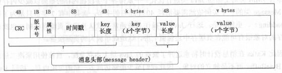
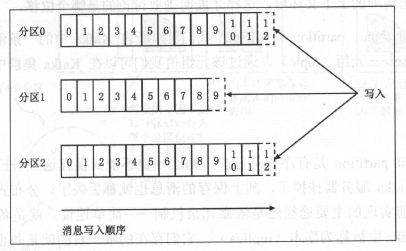
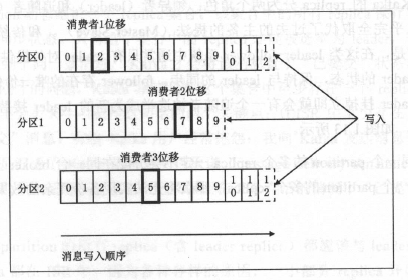
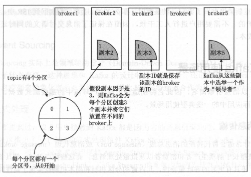

- > 公众号：大数据 Kafka 分享，https ://www.cnblogs.com/huxi2b/，知乎 huxihx
- 实时流处理 vs 传统批处理
    - 克服延时，同时实现了正确性
- Kafka 的核心功能：高性能的消息发送与高性能的消息消费。
- kafka_2.11-1.0.1.tgz
	
    ```bash
    # https://kafka.apache.org/downloads
    tar -zxf kafka_2.11-1.0.0.tgz
    cd kafka_2.11-1.0.0 

    jdk8 # alias, doesn't support jdk10
    # 启动 zookeeper 服务器
    ./bin/zookeeper-server-start.sh config/zookeeper.properties
    # [2019-07-29 21:34:50,580] INFO binding to port 0.0.0.0/0.0.0.0:2181 (org.apache.zookeeper.server.NIOServerCnxnFactory)

    # 启动 kafka 服务器
    jdk8 # alias, doesn't support jdk10
    ./bin/kafka-server-start.sh config/server.properties # 默认 9092 端口
    # [2019-07-29 21:39:01,559] INFO [KafkaServer id=0] started (kafka.server.KafkaServer)

    # 保持 zookeeper 和 kafka 终端不关闭
    # 创建 topic 用于消息的发送和接收
    # topic 名 test，只有一个分区 partition，一个副本 replica
    ./bin/kafka-topics.sh --create --zookeeper localhost:2181 --topic test --partitions 1 --replication-factor 1
    # Created topic "test".
    # 查看 topic 状态
    ./bin/kafka-topics.sh --describe --zookeeper localhost:2181 --topic test                                    
    # Topic:test      PartitionCount:1        ReplicationFactor:1     Configs:
    #    Topic: test     Partition: 0    Leader: 0       Replicas: 0     Isr: 0

    # 新终端
    # 发送消息
    ./bin/kafka-console-producer.sh --broker-list localhost:9092 --topic test
    # 输入消息，按一次回车即是一条

    # 新终端
    # 消费消息
    ./bin/kafka-console-consumer.sh --bootstrap-server localhost:9092 --topic test --from-beginning
    ```

    - 2.11 表示编译 Kafka 的 Scala 语言版本，1.0.0 是 Kafka 的版本
- *消息引擎*（消息队列、消息中间件）；Messaging system，消息引擎系统，消息传输系统
- 消息设计
    - 消息通常都采用结构化的方式进行设计。SOAP 协议中的消息就采用了 XML 格式，Web Service 也支持 JSON 格式的消息，Kafka 的消息是用二进制方式来保存的。
- 传输协议设计
    - 从狭义的角度来说，消息传输协议指定了消息在不同系统之间传输的方式。目前主流的协议包括 AMQP Web Service + SOAP 以及微软的 MSMQ 等。
    - 从广义的角度来说，这类协议可能包括何能够在不同系统间传输消息或是执行语义操作的协议或框架。比如现在主流的 RPC 及序列化框架，包括 Google 的 Protocol Buffers、阿里系的 Dubbo 等。
    - Kafka 自己设计了一套二进制的消息传输协议。
- 最常见的两种消息引擎范式是**消息队列**模型和**发布／订阅**模型。
    - 消息队列（message queue)模型是基于队列提供消息传输服务的，多用于进程间通信（inter-process communication, IPC）以及线程间通信。该模型定义了消息队列（queue）、发送者（sender）和收者（receiver) ，提供了一种点对点（point-to-point, p2p）的消息传递方式，即发送者发送每条消息到队列的指定位置，接收者从指定位置获取消息。一旦消息被消费（consumed），就会从队列中移除该消息。每条消息由一个发送者生产出来，且只被一个消费者（consumer）处理，发送者和消费者之间是一对一的关系。
        - 接线员
    - 发布／订阅模型（publish/ subscribe ，或简称为 pub/sub）有主题（topic ）的概念：一个 topic 可以理解为逻辑语义相近的消息的容器。这种模型也定义了类似于生产者／消费者这样的角色，即发布者（publisher）和订者（subscriber）。发布者将消息生产出来发送到指定的 topic 中，所有订阅了该 topic 的订阅者都以接收到该 topic 下的所有消息。通常具有相同订阅 topic 的所有订阅者将接收到同样的消息。
        - 报纸订阅
- Kafka 引入消息组（consumer group）的概念来同时支持这两种模型。
- Java 消息服务，即 Java Message Service（简称 JMS），严格来说，只是一套 API 规范，提供了很多接口用于实现分布式系统间的消息传递。JMS 同时支持上面两种消息擎模型。实际上，当前很多主流的消息引擎系统都完全支持 JMS 规范，比如 ActiveMQ、RabbitMQ（通过RabbitMQ JMS Client）、IBM WebSphere MQ 等。
    - Kafka 并没有完全遵照 JMS 规范。
- Kafka 的设计初衷就是为了解决互联网公司超大量级数据的实时传输。为了实现这个目标，Kafka 在设计之初就需要考虑以下 4 个方面的问题。
    - 吞吐量／延时
    - 消息持久化
    - 负载均衡和故障转移
    - 伸缩性
- 若 Kafka 处理一条消息需要花费 2 毫秒，那么计算得到的吞吐量不会超过 500 条消息／秒（1000/2=500）。若采用批处理（batching）的思想，不一条一条地发送消息，而是一小批一小批（micro-batch）地发送，假设在发送前我们首先会等待一段时间（假设是 8 毫秒），那么此时消息发送的延时变成了 10 毫秒（2+8），即延时增加了 4 倍，但假设在这 8 毫秒中总共累积了 1000 条消息，那么系统整体的吞吐量就变成了 100000 条／秒（1000/0.01=100000），吞吐量提升了近 200 倍。
- Kafka 会持久化所有数据到磁盘，但本质上每次写入操作其实都只是把数据写入到操作系统的页缓存（page cache）中，然后由操作系统自行决定什么时候把页缓存中的数据写回磁盘上。这样的设计有 3 个主要优势
    - 操作系统页缓存是在内存中分配的，所以消息写入的速度非常快。
    - Kafka 不必直接与底层的文件系统打交道。所有烦琐的 I/O 操作都交由操作系统来处理。
    - Kafka 写入操作采用追加写入（append）的方式，避免了磁盘随机写操作。
        - 普通 SAS 磁盘随机读／写的吞吐量很慢，但是磁盘的顺序读／写操作其实是非常快的，它的速度甚至可以匹敌内存的随机 I/O 速度。
        - Kafka 在设计时采用了追加写入消息的方式，即只能在日志文件末尾追加写入新的消息，且不允许修改己写入的消息，因此它属于典型的磁盘顺序访问型操作，所以 Kafka 消息发送的吞吐量是很高的。在实际使用过程中可以很轻松地做到每秒写入几万甚至几十万条消息。
- Kafka 在读取消息时会首先尝试从 OS 的页缓存中读取，如果命中便把消息经页缓存直接发送到网络的 Socket 上。这个过程就是利用 Linux 平台的 sendfile 系统调用做到的，而这种技术就是大名鼎鼎的零拷贝（Zero Copy）技术。
    - 传统的 Linux 操作系统中的 I/O 接口是依托于数据拷贝来实现的，一个 I/O 操作会将同一份数据进行多次拷贝。数据传输过程中还涉及内核态与用户态的上下文切换， CPU 的开销非常大，因此极大地限制了 OS 高效进行数据传输的能力。
    - 零拷贝技术很好地改善了这个情况：首先在内核驱动程序处理 I/O 数据的时候，它不再需要进行上下文的切换，节省了内核缓冲区与用户态应用程序缓冲区之间的数据拷贝，同时它利用直接存储器访问技术（Direct Memory Access, DMA）执行 I/O 操作，因此也避免了 OS 内核缓冲区之间的数据拷贝，故而得名零拷贝。
    - Kafka 的消息消费机制使用的就是 sendfile一一严格来说是通过 Java 的 `FileChannel.transferTo` 方法实现的。
- 除了零拷贝技术，Kafka 由于大量使用页缓存，故读取消息时大部分消息很有可能依然保存在页缓存中，因此可以直接命中缓存，不用“穿透”到底层的物理磁盘上获取消息，从而极大地提升了消息读取的吞吐量。
- Kafka 消息持久化的好处
    - 解辑消息发送与消息消费
    - 实现灵活的消息处理，支持消息重演（message replay）
- 普通的系统在实现持久化时可能会先尽量使用内存，当内存资源耗尽时，再一次性地把数据“刷盘”。Kafka 相反，所有数据都会立即被写入文件系统的持久化日志中，之后 Kafka 服务器才会返回结果给客户端通知它们消息已被成功写入，这样做既实时保存了数据，又减少了 Kafka 程序对于内存的消耗，从而将节省出的内存留给页缓存使用，更进一步地提升了整体性能。
- Kafka 通过智能化的 leader 选举算法（partition leader election）实现负载均衡（load balancing）。
- 故障转移（fail-over）指当服务器意外中止时，整个集群可以快速地检测到该失效（failure），井立即将该服务器上的应用或服务自动转移到其他服务器上。故障转移通常是以“心跳”或“会话”的机制来实现的，即只要主服务器与备份服务器之间的心跳无法维持或主服务器注册到服务中心的会话超时过期了，那么就认为主服务器己无法正常运行，集群会自动启动某个备份服务器来替代主服务器的工作。
    - Kafka 服务器支持故障转移的方式就是使用会话机制。每台 Kafka 服务器启动后会以会话的形式把自己注册到 ZooKeeper 服务器上。一旦该服务器运转出现问题，与 ZooKeeper 的会话便不能维持从而超时失效，此时 Kafka 集群会选举出另一台服务器来完全代替这台服务器继续提供服务。
- 阻碍线性扩容的一个很常见的因素就是状态的保存。不论是哪类分布式系统，集群中的每台服务器一定会维护很多内部状态。如果由服务器自己来保存这些状态信息，则必须要处理一致性的问题。相反，如果服务器是无状态的，状态的保存和管理交于专门的协调服务来做（比如 ZooKeeper），那么整个集群的服务器之间就无须繁重的状态共享，这极大地降低了维护复杂度。倘若要扩容集群节点，只需简单地启动新的节点机器进行自动负载均衡就可以了。
- 每台 Kafka 服务器上的状态统一交由 ZooKeeper 保管。扩展 Kafka 集群也只需要一步：启动新的 Kafka 服务器即可。
    - Kafka 服务器上并不是所有状态都不保存，它只保存了很轻量级的内部状态，因此在整个集群间维护状态一致性的代价是很低的。
- Kafka 的标准定位是分布式流式处理平台。Kafka 以消息引擎的身份出现，演化推出 Kafka Streams，也去处理原本由下游数据处理平台做的事，从而成为一个流式处理框架。
- Kafka 服务器有一个官方名字叫 *broker*。
- Kafka 中的消息格式由很多字段组成，其中的很多字段都是用于管理消息的元数据字段，对用户来说是完全透明的。Kafka 消息格式共经历过 3 次变迁，它们被分别称为 V0 、V1 和 V2 版本。
    
- 组成消息的常用字段
    - `Key`：消息键，对消息做 partition 时使用，决定消息被保存在某 topic 下的哪个 partition。
    - `Value`：消息体，保存实际的消息数据。
    - `Timestamp`：消息发送时间戳，用于流式处理及其他依赖时间的处理语义，如果不指定则取当前时间。
- topic 只是一个逻辑概念，代表了一类消息，也可以认为是消息被发送到的地方。通常使用 topic 来区分实际业务，如业务 A 使用一个 topic，业务 B 使用另外一个 topic。
- Kafka 中的 topic 通常都会被多个消费者订阅，出于性能的考量，Kafka 并不是 topic-message 的两级结构，而是采用了 topic-partition-message  的三级结构来**分散负载**。从本质上说，每个 Kafka topic 都由若干个 partition 组成。
- Kafka 的 partition 是不可修改的有序消息序列，也叫有序的消息日志。每个 partition 有自己专属的 partition 号，通常从 0 开的。用户对 partition 唯一能做的操作就是在消息序列的尾部追加写入消息。partition 的每条消息都会被分配一个唯一的序列号，称为位移（offset）。该位移值是从 0 开始顺序递增的整数。位移信息可以唯一定位到某 partition 下的一条消息。
    
- Kafka 的 partition 并没有太多业务含义，它的引入就是单纯地为了提升系统的吞吐量，因此在创建 Kafka topic 的时候可以根据集群实际配置设具体的 partition 数，实现整体性能的最大化。
- Kafka 消费者端也有位移（offset）的概念，与 partition 的 offset 属于不同的概念。每条消息在某个 partition 的位移是固定的，但消费  partition 的消费者的位移会随着消费进度不断前移，但终究不可能超过该分区最新一条消息的位移。
    
- Kafka 中的一条消息其实就是一个 `<topic,partition,offset>` 三元组（tuple），通过该元组值可以在 Kafka 集群中找到唯一对应的消息。
- 备份日志在 Kafka 中被称为副本（replica），它们存在的唯一目的就是防止数据丢失。
    - 副本分为两类：领导者副本（leader replica）和追随者副本（follower replica） 。follower replica 不能提供服务给客户端，即不负责响应客户端发来的消息写和消息消费请求，只是被动地向领导者副本（leader replica）获取数据，而一旦 leader replica 所在的 broker 岩机， Kafka 会从剩余的 replica 中选举出新的 leader 继续提供务。
- Kafka 的 replica 分为两个角色：领导者（leader）和追随者（follower）。如今这种角色设定几乎完全取代了过去的主备的提法（Master-Slave）。和传统主备系统（如 MySQL ）不同，这类 leader-follower 系统中通常只有 leader 对外提供服务，follower 只是被动地追随 leader 的状态，保持与 leader 的同步。follower 存在的唯一价值就是充当 leader 的候补，一旦 leader 挂掉立即就会有一个追随者被选举成为新的 leader 接替的工作。
- Kafka 保证同一个 **partition** 的多个 replica 一定不会分配在同一台 broker 上。
    
- ISR (in-sync replica) 是与 leader replica 保持同步的 replica 集合。Kafka 为 partition 动态维护一个 replica 集合 ISR，该集合中的所有 replica 保存的消息日志都**与 leader replica 保持同步状态**。只有这个集合中的 replica 才能被选举为 leader，也只有该集合中所有 replica 都接收到了同一条消息，Kafka 才会将该消息置于“己提交”状态，即认为这条消息发送成功。Kafka 承诺只要 ISR 中存在**至少一个** replica，那些**己提交**状态的消息就不会丢失。
    - Kafka 对于没有提交成功的消息不做任何交付保证，它只保证在 ISR 存活的情况下己提交消息不会丢失。
- 正常情况下，partition 的所有 replica（含leader replica）都应该与 leader replica 保持同步，即所有 replica 都在 ISR 中。因为各种各样的原因，一小部分 replica 开始落后于 leader replica 的进度。当滞后到一定程度时，Kafka 会将这些 replica “踢”出 ISR。当这些 replica 重新“追上”了 leader 的进度时， 那么 Kafka 会将它们加回到 ISR 中。这一切都是自动维护的，不需要用户进行人工干预。
- [ ] 累死 leader replica，同一个 topic 下的某个 partition 有否多个 leader replica？有无负载均衡？