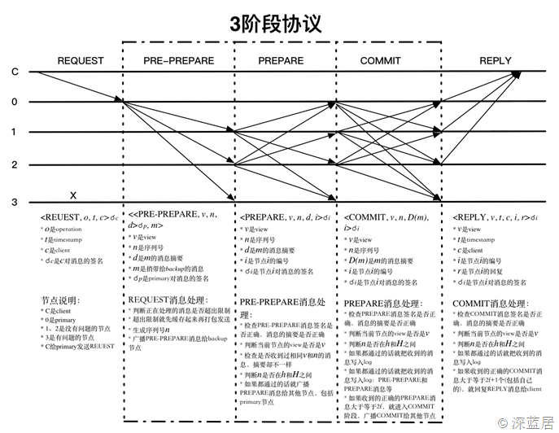

# 交易
- 部署的 Chaincode 在运行时会基于 baseimage 创建 Docker 容器
- 区块链数据用文件系统存储在 Committer 节点上。区块链中存储了 Transaction 的读写集。为了检索区块链的方便，用 LevelDB 对其中的 Transaction 进行了索引。Chaincode 操作的实际数据存储在 State Database 中
    
- `peer chaincode invoke -o orderer.example.com:7050  --tls $CORE_PEER_TLS_ENABLED --cafile /opt/gopath/src/github.com/hyperledger/fabric/peer/crypto/ordererOrganizations/example.com/orderers/orderer.example.com/msp/cacerts/ca.example.com-cert.pem  -C mychannel -n devincc -c '{"Args":["invoke","a","b","10"]}'`
    1. 客户端 SDK 把 `{"Args":["invoke","a","b","10"]}` 这些参数发送到 endorser peer 节点
    2. endorser peer 与 Chaincode 的 docker 实例通信，并为其提供**模拟**的 State Database 的读写集，也就是说 ChainCode 会执行完逻辑，但是并不会在 `stub.PutState` 的时候写数据库
    3. endorser 把这些读写集连同签名返回给 Client SDK 
    4. SDK 再把读写集发送给 Orderer 节点，Orderer 节点是进行共识的排序节点
        - 在测试的情况下，只启动一个 orderer 节点，没有容错。在生产环境，要进行 Crash 容错，需要启用 Zookeeper 和 Kafka（1.0 中移除了拜占庭容错，没有 0.6 的 PBFT，也没有传说中的 SBFT）
    5. Orderer 节点只是负责排序和打包工作，处理的结果是一个 Batch 的 Transactions，也就是一个 Block
        - Block 的产生有两种情况，一种情况是 Transaction 很多，Block 的大小达到了设定的大小，而另一种情况是 Transaction 很少，没有达到设定的大小，那么 Orderer 就会等，等到大小足够大或者超时时间。这些设置在 `configtx.yaml` 中设定
    6. 打包好的一堆 Transactions 会发送给 Committer Peer 提交节点
    7. 提交节点收到 Orderer 节点的数据后，会先进行 VSCC 校验，检查 Block 的数据是否正确。接下来是对每个 Transaction 的验证，主要是验证 Transaction 中的读写数据集是否与 State Database 的数据版本一致。验证完 Block 中的所有 Transactions 后，提交节点会把 Block 写入区块链，然后把所有验证通过的Transaction 的读写集中的**写**的部分写入 State Database。另外对于区块链，本身是文件系统，不是数据库，所有也会有把区块中的数据在 LevelDB 中建立索引的情况
    
- `peer chaincode query -C mychannel -n devincc -c '{"Args":["query","a"]}'` 调用的是 `peer query`，只有 `invoke` 的时候才会执行 Transaction 步骤中的 4、5、6、7
    - 若以 `peer chaincode invoke` 去查询，则会以 Transaction 的生命周期来处理
- Transaction 小结
    1. Fabric 不支持对同一个数据的并发事务处理，也就是说，如果我们同时运行了 `a->b 10元，b->a 10元`，那么只会第一条 Transaction 成功，而第二条失败。因为在 Committer 节点进行读写集版本验证的时候，第二条 Transaction 会验证失败（这是我完全无法接受的一点）
    2. Fabric 是异步的系统，在 Endorser 的时候 `a->b 10元，b->a 10元` 都会返回给 SDK 成功，而第二条 Transaction 在 Committer 验证失败后不进行 State Database 的写入，但是并不会通知 Client SDK，所以必须使用 EventHub 通知 Client 或者 Client 重新查询才能知道是否写入成功
    3. 不管在提交节点对事务的读写数据版本验证是否通过，因为 Block 已经在 Orderer 节点生成了，所以 Block 是被整块写入区块链的，而在 State Database 不会写入，所以会在 Transaction 之外的地方标识该 Transaction 是无效的。
    4. query 没有独立的函数出来，并不是根据只有读集没有写集而判断是 query 还是 Transaction
        - [ ] 根据什么判断
- > https://www.cnblogs.com/studyzy/p/7074829.html
# CouchDB
- 在 Fabric 1.0 中，存在 3 种类型的数据存储
    1. 一种是基于文件系统的区块链数据，这个跟比特币很像，比特币也是文件形式存储的
    2. Fabric 1.0 中的区块链存储了 Transaction 的读写集
        - 读写集到底是读什么？写什么？其实就是 State Database，也叫做 World State，里面以键值对的方式存储了在 Chaincode 中操作的业务数据
    3. 另外还有就是对历史数据和区块链索引的数据库
- 区块链是文件系统，这个目前不支持更改，**历史数据和区块链的索引是 LevelDB**，这个也不能更改。而对于 State Database，由于和业务相关，所以提供了替换数据库，目前支持默认的 LevelDB 和用户可选择的 CouchDB
- CouchDB 是一个完全局域 RESTful API 的键值数据库，也就是说不需要任何客户端，只需要通过 HTTP 请求就可以操作数据库了
- LevelDB 是 Peer 的本地数据库，那么肯定是和 Peer 一对一的关系，那么 CouchDB 是个网络数据库，应该和 Peer 是什么样一个关系呢？在生产环境中，我们会为每个组织部署节点，而且为了高可用，可能会在一个组织中部署多个 Peer。同样我们在一个组织中也部署多个 CouchDB，每个 Peer 对应一个 CouchDB
- CouchDB 在启动的时候需要指定一个本地文件夹映射成 CouchDB 的数据存储文件夹
- 安装
	
    ```bash
    mkdir ~/db/couchdb

    docker run -p 5984:5984 -d --name my-couchdb -e COUCHDB_USER=admin -e COUCHDB_PASSWORD=password -v ~/db/couchdb:/opt/couchdb/data couchdb
    # http://localhost:5984/_utils
    ```

## [ ] Fabric+CouchDB
	
```bash
docker run -p 5984:5984 -d --name couchdb0 -e COUCHDB_USER=admin -e COUCHDB_PASSWORD=password -v ~/db/couchdb0:/opt/couchdb/data couchdb
docker run -p 6984:5984 -d --name couchdb1 -e COUCHDB_USER=admin -e COUCHDB_PASSWORD=password -v ~/db/couchdb1:/opt/couchdb/data couchdb
docker run -p 7984:5984 -d --name couchdb2 -e COUCHDB_USER=admin -e COUCHDB_PASSWORD=password -v ~/db/couchdb2:/opt/couchdb/data couchdb
docker run -p 8984:5984 -d --name couchdb3 -e COUCHDB_USER=admin -e COUCHDB_PASSWORD=password -v ~/db/couchdb3:/opt/couchdb/data couchdb
```

- > https://www.cnblogs.com/studyzy/p/7101136.html
# Chaincode
- 不能在一个 ChainCode 函数中 `PutState` 后又马上 `GetState`，这个时候 `GetState` 是没有最新值的，因为在这时 Transaction 并没有完成，还没有提交到 StateDB 里面
- 单主键构成的 key 可以直接用字符串拼接
- **联合主键**的 key 可以用 `CreteCompositeKey`
	
    ```go
    type ChooseCourse struct {
        CourseNumber string //开课编号
        StudentId int       //学生ID
        Confirm bool        //是否确认
    }
    cc := ChooseCourse{"CS101",123,true}  
    // CreateCompositeKey(objectType string, attributes []string) (string, error)
    // CourseNumber + StudentId 构成了这个对象的联合主键
    var key1, _ = stub.CreateCompositeKey("ChooseCourse", []string{cc.CourseNumber, strconv.Itoa(cc.StudentId)})
    fmt.Println(key1)
    ```

    - 通过这个方法，我们可以将联合主键涉及到的属性都传进去，并声明对象的类型
    - Fabric 是用 `U+0000` 来把各个字段分割开的，因为这个字符太特殊，很适合做分割
- `SplitCompositeKey(compositeKey string) (string, []string, error)` 用 `U+0000` 把这个复合键再 Split 开，得到结果中第一个是 `objectType`，剩下的就是复合键用到的列的值
- `GetStateByPartialCompositeKey(objectType string, keys []string) (StateQueryIteratorInterface, error)`
    - This function returns an iterator which can be used to iterate over all composite keys whose **prefix** matches the given partial composite key
- `GetCreator() ([]byte, error)` 可以获得调用这个 ChainCode 的客户端的用户的证书（字符串），把这个证书的字符串转换为 `Certificate` 对象后，通过 `Subject` 获得当前用户的信息
	
    ```go
    /*
    -----BEGIN CERTIFICATE----- 
    MIICGjCCAcCgAwIBAgIRAMVe0+QZL+67Q+R2RmqsD90wCgYIKoZIzj0EAwIwczEL 
    MAkGA1UEBhMCVVMxEzARBgNVBAgTCkNhbGlmb3JuaWExFjAUBgNVBAcTDVNhbiBG 
    cmFuY2lzY28xGTAXBgNVBAoTEG9yZzEuZXhhbXBsZS5jb20xHDAaBgNVBAMTE2Nh 
    Lm9yZzEuZXhhbXBsZS5jb20wHhcNMTcwODEyMTYyNTU1WhcNMjcwODEwMTYyNTU1 
    WjBbMQswCQYDVQQGEwJVUzETMBEGA1UECBMKQ2FsaWZvcm5pYTEWMBQGA1UEBxMN 
    U2FuIEZyYW5jaXNjbzEfMB0GA1UEAwwWVXNlcjFAb3JnMS5leGFtcGxlLmNvbTBZ 
    MBMGByqGSM49AgEGCCqGSM49AwEHA0IABN7WqfFwWWKynl9SI87byp0SZO6QU1hT 
    JRatYysXX5MJJRzvvVsSTsUzQh5jmgwkPbFcvk/x4W8lj5d2Tohff+WjTTBLMA4G 
    A1UdDwEB/wQEAwIHgDAMBgNVHRMBAf8EAjAAMCsGA1UdIwQkMCKAIO2os1zK9BKe 
    Lb4P8lZOFU+3c0S5+jHnEILFWx2gNoLkMAoGCCqGSM49BAMCA0gAMEUCIQDAIDHK 
    gPZsgZjzNTkJgglZ7VgJLVFOuHgKWT9GbzhwBgIgE2YWoDpG0HuhB66UzlA+6QzJ 
    +jvM0tOVZuWyUIVmwBM= 
    -----END CERTIFICATE-----
    */

    func (t *SimpleChaincode) testCertificate(stub shim.ChaincodeStubInterface, args []string) pb.Response{
        creatorByte,_:= stub.GetCreator()
        certStart := bytes.IndexAny(creatorByte, "-----BEGIN")
        if certStart == -1 {
            fmt.Errorf("No certificate found")
        }
        certText := creatorByte[certStart:]
        bl, _ := pem.Decode(certText)
        if bl == nil {
            fmt.Errorf("Could not decode the PEM structure")
        }

        cert, err := x509.ParseCertificate(bl.Bytes)
        if err != nil {
            fmt.Errorf("ParseCertificate failed")
        }
        uname:=cert.Subject.CommonName
        fmt.Println("Name:"+uname)
        return shim.Success([]byte("Called testCertificate "+uname))
    }
    ```

- `GetStateByRange(startKey, endKey string) (StateQueryIteratorInterface, error)` 提供对某个区间的 Key 进行查询的接口，适用于任何 State DB
	
    ```go
    func getListResult(resultsIterator shim.StateQueryIteratorInterface) ([]byte,error){

        defer resultsIterator.Close()
        // buffer is a JSON array containing QueryRecords
        var buffer bytes.Buffer
        buffer.WriteString("[")

        bArrayMemberAlreadyWritten := false
        for resultsIterator.HasNext() {
            queryResponse, err := resultsIterator.Next()
            if err != nil {
                return nil, err
            }
            // Add a comma before array members, suppress it for the first array member
            if bArrayMemberAlreadyWritten == true {
                buffer.WriteString(",")
            }
            buffer.WriteString("{\"Key\":")
            buffer.WriteString("\"")
            buffer.WriteString(queryResponse.Key)
            buffer.WriteString("\"")

            buffer.WriteString(", \"Record\":")
            // Record is a JSON object, so we write as-is
            buffer.WriteString(string(queryResponse.Value))
            buffer.WriteString("}")
            bArrayMemberAlreadyWritten = true
        }
        buffer.WriteString("]")
        fmt.Printf("queryResult:\n%s\n", buffer.String())
        return buffer.Bytes(), nil
    }
    func (t *SimpleChaincode) testRangeQuery(stub shim.ChaincodeStubInterface, args []string) pb.Response{
        resultsIterator,err:= stub.GetStateByRange("Student:1", "Student:3")
        if err != nil{
            return shim.Error("Query by Range failed")
        }
        students, err := getListResult(resultsIterator)
        if err != nil{
            return shim.Error("getListResult failed")
        }
        return shim.Success(students)
    }
    ```

    - > https://godoc.org/github.com/hyperledger/fabric/core/chaincode/shim#ChaincodeStubInterface
- 富查询 `GetQueryResult(query string) (StateQueryIteratorInterface, error)` 对 Value 的内容进行查询，如果是 LevelDB，那么是不支持的，只有 CouchDB 时才能用这个方法
- 历史数据查询 `GetHistoryForKey(key string) (HistoryQueryIteratorInterface, error)`
    - > https://godoc.org/github.com/hyperledger/fabric/core/chaincode/shim#ChaincodeStubInterface
- 调用另外的链上代码 `InvokeChaincode(chaincodeName string, args [][]byte, channel string) pb.Response`
	
    ```go
    func (t *SimpleChaincode) testInvokeChainCode(stub shim.ChaincodeStubInterface, args []string) pb.Response{
        trans:=[][]byte{[]byte("invoke"), []byte("a"), []byte("b"), []byte("11")}
        response:= stub.InvokeChaincode("mycc", trans, "mychannel")
        fmt.Println(response.Message)
        return shim.Success([]byte(response.Message))
    }
    ```

    - 使用的是 example02 的链上代码的实例名 `mycc`，而不是代码的名字 example02
- 获得提案对象 Proposal 属性: `GetSignedProposal() (*pb.SignedProposal, error)`, `GetTransient() (map[string][]byte, error)`, `GetTxTimestamp() (*timestamp.Timestamp, error)`, `GetBinding() ([]byte, error)`
- `SetEvent(name string, payload []byte) error`, 当 ChainCode 提交完毕，会通过 Event 的方式通知 Client
- > https://www.cnblogs.com/studyzy/p/7360733.html
# 区块链共识演进
- FLP 不可能原理（FLP impossibility）：在网络可靠，存在节点失效（即便只有一个）的最小化异步模型系统中，不存在一个可以解决一致性问题的确定性算法。1985 年 FLP 原理实际上说明对于允许节点失效情况下，纯粹异步系统无法确保一致性在有限时间内完成。科学告诉你什么是不可能的；工程则告诉你，付出一些代价，我可以把它变成可能。
- 分布式计算系统不可能同时确保一致性（Consistency）、可用性（Availability）和分区容忍性（Partition），设计中往往需要弱化对某个特性的保证。
    - 一致性（Consistency）：任何操作应该都是原子的，发生在后面的事件能看到前面事件发生导致的结果，注意这里指的是强一致性。
        - 弱化一致性：对结果一致性不敏感的应用，可以允许在新版本上线后过一段时间才更新成功，期间不保证一致性。例如网站静态页面内容、实时性较弱的查询类数据库等，CouchDB、Cassandra 等为此设计。
    - 可用性（Availability）：在有限时间内，任何非失败节点都能应答请求。
        - 弱化可用性：对结果一致性很敏感的应用，例如银行取款机，当系统故障时候会拒绝服务。MongoDB、Redis 等为此设计。Paxos、Raft 等算法，主要处理这种情况。
    - 分区容忍性（Partition）：网络可能发生分区，即节点之间的通信不可保障。
        - 现实中，网络分区出现概率减小，但较难避免。某些关系型数据库、ZooKeeper 即为此设计。实践中，网络通过双通道等机制增强可靠性，达到高稳定的网络通信。
- 一个分布式系统里面，节点组成的网络本来应该是连通的。然而可能因为一些故障，使得有些节点之间不连通了，整个网络就分成了几块区域。数据就散布在了这些不连通的区域中。这就叫分区。当你一个数据项只在一个节点中保存，那么分区出现后，和这个节点不连通的部分就访问不到这个数据了。这时分区就是无法容忍的。提高分区容忍性的办法就是一个数据项复制到多个节点上，那么出现分区之后，这一数据项就可能分布到各个区里。容忍性就提高了。然而，要把数据复制到多个节点，就会带来一致性的问题，就是多个节点上面的数据可能是不一致的。要保证一致，每次写操作就都要等待全部节点写成功，而这等待又会带来可用性的问题。总的来说就是，数据存在的节点越多，分区容忍性越高，但要复制更新的数据就越多，一致性就越难保证。为了保证一致性，更新所有节点数据所需要的时间就越长，可用性就会降低。
    - > https://www.zhihu.com/question/54105974/answer/139037688
- 共识
    - 当多个主机通过异步通讯方式组成网络集群时，这种异步网络默认是不可靠的，那么在这些不可靠主机之间复制状态需要采取一种机制，以保证每个主机的状态最终达成相同一致性状态，取得共识。
        - 根据 FLP 原理（Impossibility of Distributed Consensus with One Faulty Process）：在一个异步系统中我们不可能确切知道任何一台主机是否死机了，因为我们无法分清楚主机或网络的性能减慢与主机死机的区别，也就是说我们无法可靠地侦测到失败错误。但是，我们还必须确保安全可靠。
    - 达成共识越分散的过程，其效率就越低，但满意度越高，因此也越稳定；相反，达成共识越集中的过程，效率越高，也越容易出现独裁和腐败现象。
    - 达成共识常用的一种方法就是通过物质上的激励以对某个事件达成共识，但是这种共识存在的问题就是容易被外界其它更大的物质激励所破坏。还有一种就是群体中的个体按照符合自身利益或整个群体利益的方向来对某个事件自发地达成共识，当然形成这种自发式的以维护群体利益为核心的共识过程还是需要时间和环境因素的，但是一旦达成这样的共识趋势，其共识结果也越稳定，越不容易被破坏。
- Paxos 问题是指分布式的系统中存在故障，但不存在恶意节点场景（即可能消息丢失或重复，但无错误消息）下的共识达成问题，因为最早是 1990 年 Leslie Lamport 用 Paxon 岛的故事模型来进行描述而命名。 
    - Paxos 过于晦涩难懂，和难以实现，之后有出现了各种改进算法：Egalitarian Paxos、Hydra、Fast Paxos、Ios、VRR (Viewstamped Replication Revisited)、 Multi-Paxos、Raft 等。
        - Raft 算法是 Paxos 算法的一种简化实现，2013年才问世。Paxos 是一种无领导人 Leaderless 算法，而 Raft 算法是一种强领导力 Leadership 的算法。
## 拜占庭将军问题，两军问题
- The Byzantine Generals Problem, Byzantine Failure
    - 拜占庭帝国想要进攻一个强大的敌人，为此派出了 10 支军队去包围这个敌人。这个敌人虽不比拜占庭帝国，但也足以抵御 5 支常规拜占庭军队的同时袭击。基于一些原因，这 10 支军队不能集合在一起单点突破，必须在分开的包围状态下同时攻击。他们任一支军队单独进攻都毫无胜算，除非有至少 6 支军队同时袭击才能攻下敌国。他们分散在敌国的四周，依靠通信兵相互通信来协商进攻意向及进攻时间。困扰这些将军的问题是，他们不确定他们中是否有叛徒，叛徒可能擅自变更进攻意向或者进攻时间。在这种状态下，拜占庭将军们能否找到一种分布式的协议来让他们能够远程协商，从而赢取战斗？这就是著名的拜占庭将军问题。
    - 核心描述是军中可能有叛徒，却要保证进攻一致，由此引申到计算领域，发展成了一种**容错**理论。
- 白军驻扎在沟渠里，蓝军则分散在沟渠两边。白军比任何一支蓝军都更为强大，但是蓝军若能同时合力进攻则能够打败白军。他们不能够远程的沟通，只能派遣通信兵穿过沟渠去通知对方蓝军协商进攻时间。是否存在一个能使蓝军必胜的通信协议，这就是两军问题。
    - 通信兵得经过敌人的沟渠，在这过程中他可能被捕，也就是说，两军问题中信道是不可靠的，并且其中没有叛徒之说，这就是两军问题和拜占庭将军问题的根本性不同。
- 针对拜占庭将军问题，目前业界比较常用的是 PBFT 算法。PBFT 是 Practical Byzantine Fault Tolerance 的缩写，意为实用拜占庭容错算法。该算法解决了原始拜占庭容错算法效率不高的问题，将算法复杂度由指数级降低到多项式级，使得拜占庭容错算法在实际系统应用中变得可行。这个算法在保证活性和安全性的前提下提供了 (n-1)/3 的容错性，也就是节点数需要达到 3f+1 个节点才能容错 f 个节点。
    - 4 个节点组成的分布式网络下 PBFT 算法的节点间网络通信
    
        - PBFT 算法下，网络通信的复杂度达到了 O(n²)，这也就意味着，PBFT 网络节点不能太多，如果节点太多将会造成网络风暴，使得整个网络堵塞。
- CFT 是 Crash Fault Tolerant 的简写，是无恶意节点的情况下的容错，常用的共识算法有 Paxos、Raft
- BFT 是 Byzantine Fault Tolerant 的简写，是有恶意节点的情况下的容错，常用的共识算法有 PBFT、POW
## PoW
- Proof of Work，工作证明相关理念最早于 1993 年被 Cynthia Dwork 和 Moni Naor 提出，之后的几年，该概念在是否能有效对抗拒绝服务攻击的争论中不断被人们所知。PoW 机制的核心在于强迫攻击者作出一定量的工作才能进行接下来的交互操作，这样无形中就给攻击者提高了攻击的成本。攻击者需要完成的工作可以按消耗的计算机资源种类分为以下三大类：
    - 消耗CPU资源。例如，反垃圾邮件的 Hashcash 方案以及受此启发而诞生的比特币；
    - 消耗内存资源。例如，为了防止与比特币采用相同的共识机制可能导致的 51% 攻击，以太坊目前就使用了一种需要占用大量内存资源的 PoW 算法；
    - 消耗网络资源。攻击者在进行拒绝服务攻击之前，必须要获取多个远程服务器发送的命令。
- 比特币采用 PoW 共识，通过计算来猜测一个数值（nonce），得以解决规定的 Hash 问题（两次 SHA256）。保证在一段时间内，系统中只能出现少数合法提案。同时，这些少量的合法提案会在网络中进行广播，收到的用户进行验证后会基于它认为的最长链继续进行难题的计算。因此，系统中可能出现链的分叉（Fork），但最终会有一条链成为最长的链。Hash 问题具有不可逆的特点，因此，目前除了暴力计算外，还没有有效的算法进行解决。反之，如果获得符合要求的 nonce，则说明在概率上是付出了对应的算力。谁的算力多，谁最先解决问题的概率就越大。当掌握超过全网一半算力时，从概率上就能控制网络中链的走向，这也是所谓 51% 攻击的由来。
- 由于比特币采用的是比较简单的 SHA256 哈希算法作为 PoW 共识算法，这个算法只消耗 CPU 资源，对内存要求不高，所以可以很容易被制造出 ASIC 芯片。这样算力就越来越集中到了大矿主手里，普通用户使用电脑根本不可能挖到矿，这与中本聪当年设想的人人都能公平记账的愿景相违背。为此，人们设计了各种反 ASIC 化的方案。主要思想就是将 PoW 算法改的很复杂，需要大量的内存，这样 ASIC 芯片是不可能集成大量内存进去的，从而无法制造出专门的挖矿芯片。比较有代码的改进方案有：
    - 莱特币：刚性内存哈希函数 Scrypt 取代 SHA256
    - 达世币：X11，11 种哈希函数混合使用
    - 以太坊：Ethash，大内存 DAG 搜索
    - > 实际上，只要利益足够大，人们总能够设计出专门 PoW 挖矿的矿机，莱特币矿机和达世币矿机先后被制造了出来，以太坊之前也顶多是使用显卡挖矿，最近比特大陆也研发出了专门进行以太坊挖矿的专业矿机“蚂蚁矿机 E3”。
- 中本聪为了解决拜占庭共识问题，在比特币系统中引入竞争挖矿的机制。同时，为了保证最大可能的公平性，采用了基于哈希运算的 PoW 共识机制。矿工如果想要得到一个合法的区块，则必须向**区块头**中填入不同的随机值，然后计算出**区块头的哈希值**，使得得到的哈希值**小于**目标值。这样，矿工在不断寻找合适随机值的过程中完成了一定的工作量。可以发现，矿工完成的这个工作量对于现实社会毫无意义，唯一的意义就是保障了比特币的安全性。
- 比特币的 PoW 算法是没有任何实际意义的 SHA256 运算，那么有没有可能在挖矿的同时，把这些算力算出一些副产物？以下是几个比较有名的进行有效工作量证明的区块链：
    - 质数币：Primecoin（质数币）。其最大的特点是将虚拟货币中浪费的算法资源利用起来。它的 PoW 可以搜索质数，从而计算孪生素数表，所以有一定的科学价值。
    - 治疗币：Curecoin（治疗币）。治疗币最大的特点是将蛋白质褶皱结构的研究与 SHA256 工作量证明算法进行了结合。因为蛋白质褶皱研究需要对蛋白质生化反应的模拟过程投入大量的计算资源，所以在“挖矿”的同时，还用于发现治愈疾病的新药，一举两得。
    - 比原链：比原链重新设计一种不同于比特币的哈希运算 PoW 共识机制，引入了矩阵运算与卷积运算，这样就能让人工智能运算充分利用比原链的挖矿设备。在这个过程中，人工智能加入了新的硬件，其算法运行速度得到明显提高。同时，这样也能减少一定的资源浪费。在这种情况下，矿机市场巨大的经济利益能够极大地加速人工智能 ASIC 芯片的发展，加快人工智能的研究。反过来，人工智能的快速发展也产生了更多的 ASIC 矿机需求。因此，这是一种正向反馈良性发展的过程。
## PoS (Proof of Stake)
- 如果说 PoW 主要比拼算力，算力越大，挖到一个块的概率越大，PoS 则是比拼余额，通俗说就是自己的手里的币越多，挖到一个块的概率越大。
- PoS 共识算法存在一个漏洞，就是鼎鼎大名的 Nothing-at-Stake 攻击（常写作 N@S）。
    - 假设系统中出现了两个分支链，那么对于持有币的“挖矿者”来讲，最佳的操作策略就是同时在两个分支上进行“挖矿”，这样，无论哪个分支胜出，对币种持有者来讲，都会获得本属于他的利益，即不会有利益损失。而且由于不需要算力消耗，因此 PoS 中在两个分支上挖矿是可行的。这导致的问题是，只要系统存在分叉，“矿工们”都会同时在这几个分支上挖矿；因此在某个情况下，发起攻击的分叉链是极有可能成功的，因为所有人也都在这个分叉链上达成了共识；而且甚至不用持有 51% 的币量，就可以成功发起分叉攻击。而这在 PoW 中是不可行的，因为挖矿需要消耗算力，矿工只能在一个分支上进行挖矿。所以在实际 PoS 算法中，还需要加入一些惩罚机制，如果矿工被发现两个分支同时挖矿，就会进行惩罚。
- Peercoin（点点币，PPC）于 2012 年 8 月发布，最大创新是其采矿方式混合了 PoW 工作量证明及 PoS 权益证明方式，其中 PoW 主要用于发行货币，未来预计随着挖矿难度上升，产量降低，系统安全主要由 PoS 维护。目前区块链中存在两种类型的区块，PoW 区块和 PoS 区块。PPC 的作者为同样不愿意公开身份的密码货币极客 Sunny King，同时也是 Primecoin 的发明者。
- 2013 年 9 月，一个名为 BCNext 的用户在 Bitcointalk 论坛发起一个帖子，宣布将发行一种全新的纯 PoS 币种，后来取名为 Nextcoin，简称 NXT。Nxt 是且是第一个 100% 的纯 PoS 的电子货币，Nxt 不再通过消耗大量的资源“挖矿”产生新货币，而是通过现有账户的余额去“锻造”区块，并给与成功“锻造”区块的账户交易费用奖励。NXT 的 PoS 实现方式与 PPC 完全不同，合格区块判定方法为 `hit < baseTarget * effectiveBalance * elapseTime`。hit 是根据最新区块和用户的私钥生成的值，用户在挖一个区块时只需要计算一次即可；而右边的值跟账户余额成正比，跟流逝的时间成正比。也就意味着，用户账户余额越多，挖到矿的几率越高，随着时间的流逝越久，越容易找到新的区块。NXT 区块的生成完全摒弃了竞争的理念，有点“上帝早已安排好一切”的味道，下一个区块由谁来生成冥冥中早就注定了，全网节点能做的就是静静等待那一刻的到来。
- PoS 的本质就是比谁的钱多，钱越多越容易挖到区块，这将会造成富者越富，资源越来越集中，从而变得更中心化。
## DPoS
- 比特股核心账本采用石墨稀技术，对交易容量和区块速度有极高要求，显然 PoW 或 PoS 都达不到要求，于是比特股发明了一种新的共识机制——Delegated Proof-Of-Stake，即**代理**股权证明。DPoS 类似于现代企业董事会制度，比特股系统将代币持有者称为股东，由股东投票选出 101 名代表，然后由这些代表负责产生区块。那么需要解决的核心问题主要有：代表如何被选出，代表如何自由退出“董事会”，代表之间如何协作产生区块等。持币者若想成为一名代表，需先拿自己的公钥去区块链注册，获得一个长度为 32 位的特有身份标识符，用户可以对这个标识符以交易的形式进行投票，得票数前 101 位被选为代表。代表们轮流产生区块，收益（交易手续费）平分。如果有代表不老实生产区块，很容易被其他代表和股东发现，他将立即被踢出“董事会”，空缺位置由票数排名 102 的代表自动填补。从某种角度来说，DPoS 可以理解为多中心系统，兼具去中心化和中心化优势。
### EOS
- EOS 也是采用了 DPoS 共识。EOS 通过投票的方式选举出 21 个超级节点作为记账节点，每个节点有 3 秒的时间片，轮流记账。如果轮到某节点记账而没有出块，则该节点可能被投票出局，由其他备选节点顶替，出块速度是 0.5 秒。
- > https://www.cnblogs.com/studyzy/p/8849818.html